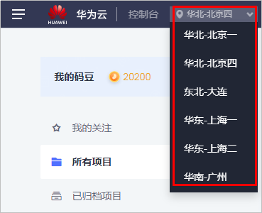

# **项目成员迁移**

## **项目迁移流程**

项目成员迁移需要先从SVN中导出已有的用户信息，并根据DevCloud支持的角色重新划分成员角色，从而将已有成员迁移至DevCloud。

1.  [步骤1：获取SVN角色信息](#section15423192204911)

    从SVN中导出已有的用户信息。

2.  [步骤2：创建项目](#section149687147492)

    在服务中创建用于成员管理的项目。

3.  [步骤3：创建代码仓库](#section480644834912)

    创建代码仓库用于存放代码。

## **步骤1：获取SVN角色信息**

1.  进入SVN服务器相应配置目录（本文为“/var/svnrepos/DevOpsOnDevCloud/conf“\)，查看passwd文件，获取相应用户名、密码等信息。

    

2.  进入SVN服务器相应配置目录（本文为“/var/svnrepos/DevOpsOnDevCloud/conf“\)，查看authz文件，获取该SVN服务器下相应用户组权限设置信息。

    

## **步骤2：创建项目**

1.  使用华为云账号登录[DevCloud](https://devcloud.cn-north-4.huaweicloud.com/home)。
2.  在页面左上角根据您业务所在区域就近选择区域，可减少网络时延，提高访问速度；不同区域的软件开发服务之间内网互不相通。例如您当前在北京，区域可以就近选择“华北-北京四“。

    

3.  单击页面右上角**新建项目**，创建新的项目。DevCloud支持Scrum和看板两种项目类型，由于迁移源SVN仓库管理较为简单，选择看板项目即可。

    

4.  项目创建成功后，会直接跳转到“成员管理“界面中添加成员。

    -   如果“本企业用户“下已有需要添加的用户，直接勾选账号添加即可。
    -   如果还没有成员，则单击右上角“创建用户“跳转到统一身份认证服务IAM中，根据GitLab导出的用户进行创建。创建方法请参见[创建IAM用户](https://support.huaweicloud.com/usermanual-iam/iam_02_0001.html)。

    

    也可以后续通过“设置  \>  通用设置  \>  成员管理“页面添加成员。

    

    > **说明：**   
    >1.  当项目中的成员数量等于5人时，不收取费用，当超过5人后，需要购买套餐才可以继续使用，套餐请参见[产品价格详情](https://www.huaweicloud.com/pricing.html?tab=detail#/devcloud)。  
    >2.  新账号创建看板项目成功后，会看到弹框提示输入真实姓名，需完成此设置后才能添加项目成员。  

    DevCloud中每添加一个成员，都需为其配置一个项目角色，每个项目角色对应不同的代码仓库权限，从而实现基于角色的隔离权限。

    SVN中通过设置User、Group来做权限管理，User对应DevCloud的项目成员，Group对应DevCloud的项目角色，根据角色权限，建议角色对应关系如下表所示。DevCloud中角色设置方法请参见[设置项目角色](https://support.huaweicloud.com/usermanual-projectman/devcloud_hlp_00026.html#section8)。

    
    <table><thead align="left"><tr id="row22779120369"><th class="cellrowborder" valign="top" width="33.33333333333333%" id="mcps1.1.4.1.1">
<strong id="b203146206">SVN角色</strong>

    </th>
    <th class="cellrowborder" valign="top" width="33.33333333333333%" id="mcps1.1.4.1.2">
<strong id="b115841201">DevCloud项目角色</strong>

    </th>
    <th class="cellrowborder" valign="top" width="33.33333333333333%" id="mcps1.1.4.1.3">
<strong id="b731042201">DevCloud代码仓库角色</strong>

    </th>
    </tr>
    </thead>
    <tbody><tr id="row15278181214363"><td class="cellrowborder" valign="top" width="33.33333333333333%" headers="mcps1.1.4.1.1 ">
SVN 仓库管理员

    </td>
    <td class="cellrowborder" valign="top" width="33.33333333333333%" headers="mcps1.1.4.1.2 ">
项目创建者/项目经理

    </td>
    <td class="cellrowborder" valign="top" width="33.33333333333333%" headers="mcps1.1.4.1.3 ">
仓库管理员

    </td>
    </tr>
    <tr id="row638252503613"><td class="cellrowborder" valign="top" width="33.33333333333333%" headers="mcps1.1.4.1.1 ">
读写权限人员

    </td>
    <td class="cellrowborder" valign="top" width="33.33333333333333%" headers="mcps1.1.4.1.2 ">
开发人员

    </td>
    <td class="cellrowborder" valign="top" width="33.33333333333333%" headers="mcps1.1.4.1.3 ">
仓库普通成员

    </td>
    </tr>
    <tr id="row18278121223612"><td class="cellrowborder" valign="top" width="33.33333333333333%" headers="mcps1.1.4.1.1 ">
只读权限人员

    </td>
    <td class="cellrowborder" valign="top" width="33.33333333333333%" headers="mcps1.1.4.1.2 ">
测试经理、测试人员、浏览者、参与者

    </td>
    <td class="cellrowborder" valign="top" width="33.33333333333333%" headers="mcps1.1.4.1.3 ">
仓库浏览者

    </td>
    </tr>
    </tbody>
    </table>

    关于仓库管理员，仓库普通成员以及仓库浏览者的操作权限区别，请查看[代码托管-基础角色权限](https://support.huaweicloud.com/usermanual-codehub/codehub_hlp_0005.html)说明。

    项目人员添加完成后，对应上面的角色对应表，结果如下图所示（其中，xiehao对应SVN中的admin）：

    

## **步骤3：创建代码仓库**

完成项目创建后，请为项目创建代码仓库，用于存放代码。

1.  进入项目，单击页面上方导航“代码  \>  代码托管“，进入代码托管服务。
2.  单击右上角“普通新建“按钮，输入代码仓库名称，并勾选“允许项目内人员访问仓库“，单击“确定“保存。

    项目内的项目经理、开发人员会被加入到代码仓库中，具有操作权限。

    

3.  为代码仓库添加只读成员。单击仓库名称进入代码仓库，选择“成员“页签，勾选“允许项目内的浏览者访问仓库“，单击“确认“保存。

    单击“立即同步“，项目内测试经理、测试人员、浏览者、参与者会被加入代码仓库，具有只读权限。

    

