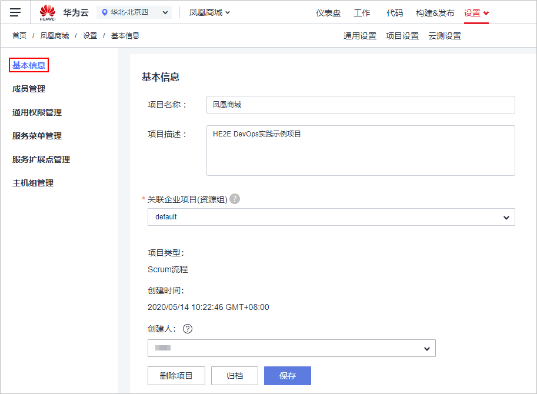
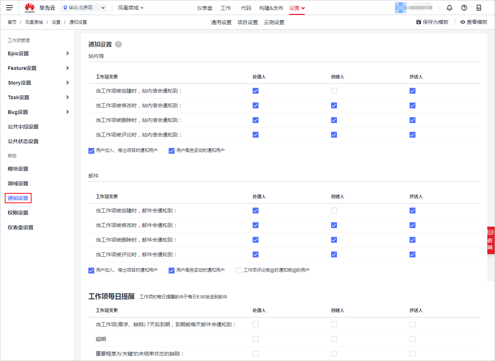
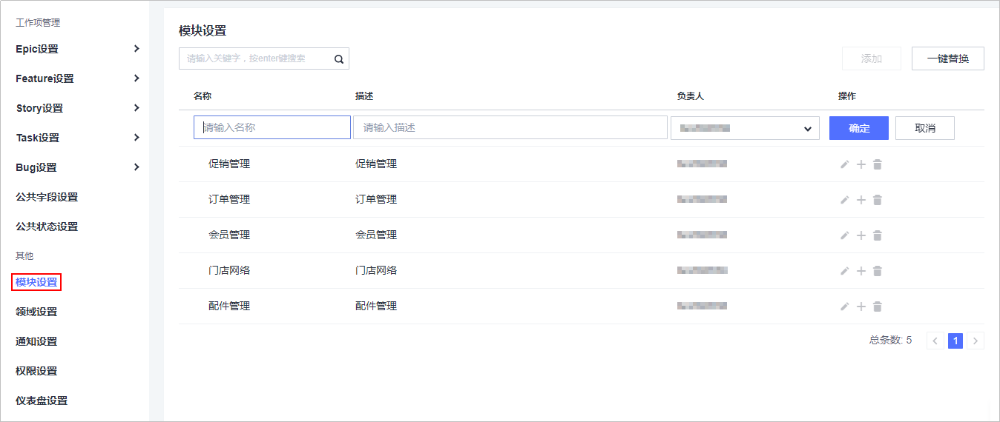
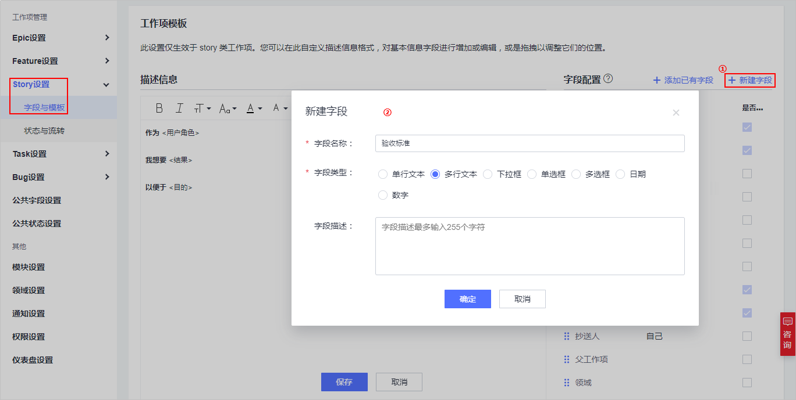
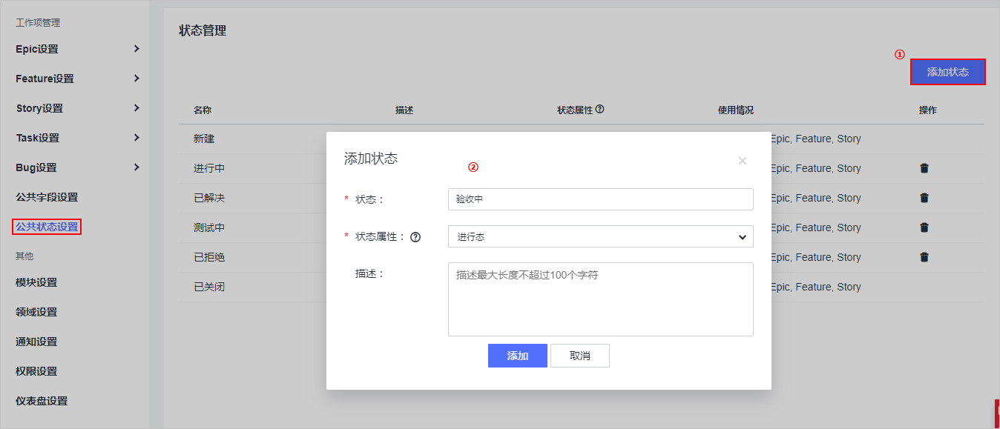
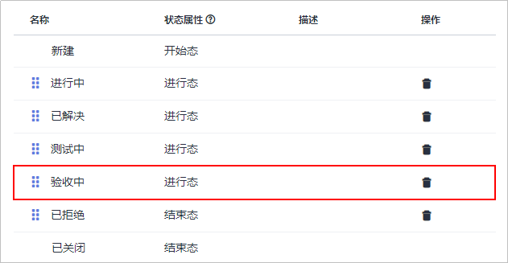

# **使用DevCloud管理项目配置**<a name="devcloud_practice_2002"></a>

## **01.维护项目基本信息，成员和通知功能**<a name="section10905668"></a>

通过本节，您将学习如何对凤凰商城基本信息进行维护，并学习如何通过定制站内消息通知以及邮件通知来跟进项目进度。

```
背景
克里斯（应用程序开发部副总裁）：我们上几个迭代对业务交付的需求好多都有偏差，业务部门已经找我抱怨很多次了。
产品负责人（PO）：可能是我们对用户故事没有明确的验收标准导致的，很多开发按照自己的想法去做了。
克里斯：对，每一个需求必须定义严格的验收标准，这样既能确保开发按照标准进行工作、也能帮助测试人员更好的理解需求！另外好好梳理下我们的工作流程以及工作表单，确保整个流程以及表单更适合凤凰商城的实际情况。
```

-   **项目基本信息设置**
    1.  进入项目，单击页面上方导航“设置  \>  通用设置“。
    2.  单击页面左侧菜单“基本信息“，进入“基本信息“页面。

        管理员可根据情况进行修改项目名称、项目描述，移交创建人，完成编辑，单击“保存“。

        

          


-   **站内通知以及邮件通知设置**

    1.  进入项目，单击页面上方导航“设置  \>  项目设置“。
    2.  单击页面左侧菜单“通知设置“，进入“通知设置“页面。
    3.  根据需要勾选通知场景、方式、对象即可，系统将自动保存。

        

      


-   **模块添加与管理**
    1.  进入项目，单击页面上方导航“设置  \>  项目设置“。
    2.  单击页面左侧菜单“模块设置“，进入“模块设置“页面。
    3.  单击“添加“，输入名称、描述，选择负责人，单击“确定“保存。

        

          


## **02.定制项目工作流程**<a name="section31042155"></a>

通过本节，您将学习如何使用**自定义工作项模版**功能来定制个性化的工作项表单，以及工作流程定制。

-   **增加工作项字段**
    1.  进入项目，单击页面上方导航“设置  \>  项目设置“。
    2.  单击页面左侧菜单“Story设置  \>  字段与模板“，进入“工作项模板“页面。
    3.  单击页面右上角“编辑模板“，选择“新建字段“。

        在弹框中输入字段名称“验收标准“，勾选字段类型“多行文本“，单击“确定“保存。

        

          

        将“验收标准“拖至“以下为查看更多的内容“上方，并勾选为必填字段，单击“保存“。

        

          


-   **增加工作项状态**
    1.  进入项目，单击页面上方导航“设置  \>  项目设置“。
    2.  单击页面左侧菜单“公共状态设置“，进入“状态管理“页面。

        单击“添加状态“，在弹框中输入状态“验收中“，选择状态属性为“进行态“，单击“添加“保存。

        

          

    3.  单击页面左侧菜单“Story设置  \>  状态与流转“，进入“工作项状态“页面。

        单击“添加已有状态“，在弹框中勾选“验收中“，单击“确定“保存。

        

          

        通过拖拽将该状态的顺序至于“测试中“之后。

        

          


