# **使用Git代码托管支撑敏捷团队持续交付**<a name="devcloud_practice_2004"></a>

通过本章节，您将了解如何使用Git**代码托管**服务进行源代码管理，并对门店网络查询功能进行开发，以及如何使用功能分支的方式进行代码的开发合并。

## 01.**使用CloudIDE修改和提交代码**<a name="section1333324173518"></a>

通过本节，您将学习如何通过**CloudIDE**完成需求“添加门店网络菜单“的代码开发。

1.  登录DevCloud，单击项目名称，进入“Backlog“页面。

    找到Story“作为用户应该可以查看、查询所有门店网络“，记录该Story的编号。

    

      

2.  单击页面上方导航“代码  \>  代码托管“，进入代码托管服务。

    找到样例项目预置的代码仓库“phoenix-sample“，单击图标，跳转至CloudIDE。

    

      

3.  等待CloudIDE加载完毕。

    在左侧导航中找到文件“/vote/templates/index.html“并打开，在179行添加菜单“门店网络“.

    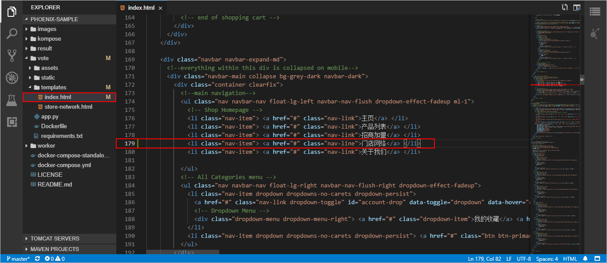

      

4.  <a name="li7319628103519"></a>提交修改至代码仓库。
    1.  单击左侧边栏图标，打开Git功能。
    2.  单击修改文件后方的图标，将修改内容添加进提交内容当中。
    3.  在输入框中输入提交信息：fix \#_工作项编码 本次提交的注释信息_。
    4.  单击图标提交本次修改。
    5.  单击图标，在下拉列表中单击“Push“，推送代码到代码仓库。

        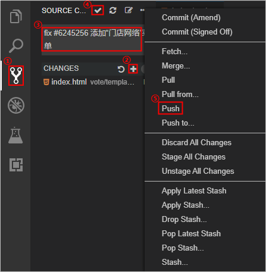

          

5.  返回“代码托管“页面，单击仓库名称进入代码仓库。

    选择“历史“页签，即可查看是否提交成功。

    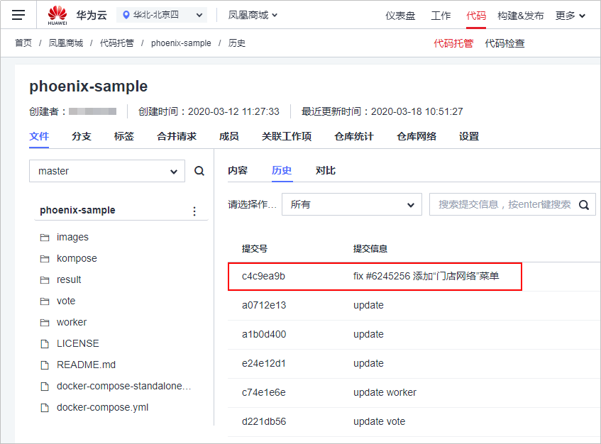

      

6.  跳转至“Backlog“页面，单击Story“作为用户应该可以查看、查询所有门店网络“。

    在“关联“页签中，单击“代码提交记录“，即可找到一条记录。

    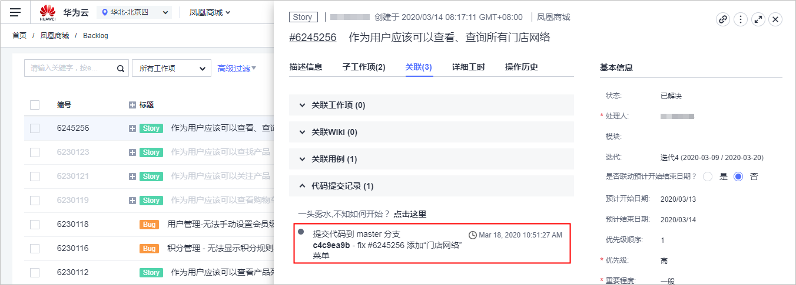

      


## **02.使用Git进行本地修改和提交代码（选做）**<a name="section65506178"></a>

在本节中，您将学习如何创建，克隆和推送Git存储库，并将本地修改同步到**代码托管**服务中。

在进行操作前，首先通过[Git官网](https://git-scm.com/download/win)下载安装包，并使用默认配置安装Git客户端到本地电脑。

-   **配置HTTPS密码**
    1.  进入项目，单击页面上方导航“代码  \>  代码托管“，进入代码托管服务。
    2.  单击“设置我的HTTPS密码“，进入“HTTPS密码管理“页面。
    3.  初次设置时，单击“自行设置密码“。
        -   单击“设置与华为云登录密码相同“，可将HTTPS密码与登录密码保持一致。
        -   单击“修改“，输入邮箱验证码、新密码、确认密码，单击“保存“完成修改。

            > **说明：**   
            >-   若登录账号未绑定邮箱，则需要根据页面提示绑定邮箱后再修改密码。  
            >-   HTTPS访问Git仓库时，输入的用户名格式为：租户名/IAM用户名；若非IAM登录，则输入租户名/租户名。  
            >-   更详细操作，请参照[代码托管-设置SSH密钥/HTTPS密码](https://support.huaweicloud.com/usermanual-codehub/devcloud_hlp_00083.html)。  


-   **设置SSH密钥（可选）**
    1.  进入代码托管服务，单击“设置我的SSH密钥“，进入“SSH密钥管理“页面。
    2.  单击“添加SSH密钥“。根据页面说明，使用Git客户端生成SSH密钥，并复制到页面中，单击“确定“保存。

-   **克隆Git代码仓库**
    1.  返回“代码托管“页面，找到代码仓库“phoenix-sample“.

        单击“仓库URL“一列中的“HTTPS“，系统将提示“复制成功“。

    2.  在本地电脑打开Git客户端，输入以下命令：

        ```
        git clone 仓库HTTPS地址
        ```

        根据提示，输入HTTPS用户名和密码。

        当出现以下提示时，表示克隆成功。若克隆失败，请根据错误提示并参考[代码托管-常见问题-常见报错解决方法](https://support.huaweicloud.com/codehub_faq/codehub_faq_3333.html)排查。

        

          


-   **提交代码，并链接到工作项**

    参照[01.使用CloudIDE修改和提交代码](#section1333324173518)，使用本地IDE修改代码后，使用Git客户端输入以下命令提交代码。

    ```
    git add . 
    git commit -m "fix #工作项编码 本次提交的注释信息" 
    git push
    ```


## **03.使用Git分支+合并请求方式提交代码并进行代码检视**<a name="section52684690"></a>

通过本节，您将学习如何通过功能分支以及拉取请求的方式完成用户故事的开发，以及在线代码检视。

**背景：收到新的邮件通知**

```
发件人：开发经理
收件人：凤凰商城开发团队 

优先级：高 
主题：凤凰商城开发模式 - 建议使用功能分支+合并请求的方式 

Hi 兄弟们：  

为了保证凤凰商城的稳定运行，我们需要有一个稳定的持续可用的分支“Master”，所以我不建议任何人直接在Master分支上进行代码开发。 请大家在后面的功能开发中统一使用功能分支+合并请求的方式进行功能的开发与合并。

而且我建议每一个功能分支的代码，必须经过团队的其他成员评审后，才可以进行合并。

谢谢大家的配合。
```

-   **将master分支设置为受保护分支**
    1.  进入项目，单击页面上方导航“代码  \>  代码托管“，进入代码托管服务。

        单击仓库名称，进入代码仓库。

    2.  选择“设置“页签，在左侧导航中单击“仓库管理  \>  保护分支管理“。
    3.  单击“新建分支保护“，根据需要在弹框中选择配置，单击“确定“保存。

        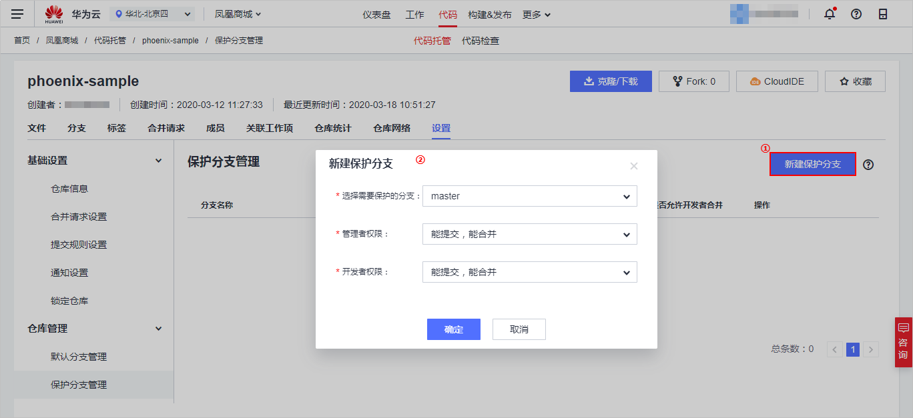

          


-   <a name="li050856144112"></a>**管理分支合并策略**
    1.  进入代码仓库，选择“设置“页签，在左侧导航中单击“基础设置  \>  合并请求设置“。
    2.  选择允许分支合并的最低评分，单击“确认“保存。

        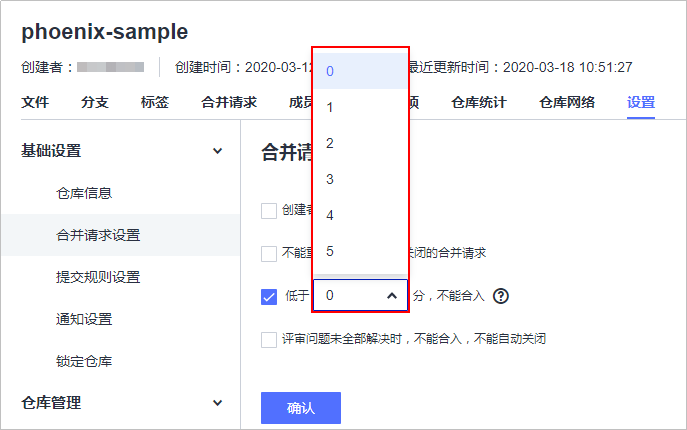

        > **说明：**   
        >通常我们会建议为3分。如果不打算使用这个功能，可以设置为0分。  

          


-   **创建分支并进行新功能开发**
    1.  进入代码仓库。选择“分支“页签，单击新建分支，在弹框中输入分支名称，单击“确定“保存。

        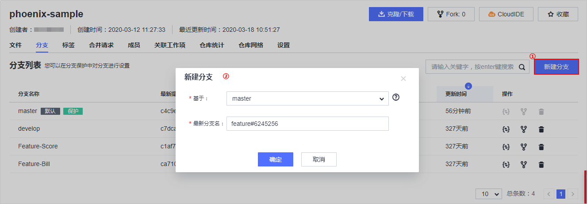

        > **说明：**   
        >为了更好的区别分支所开发的功能，本文建议采用“feature+工作项编号“命名分支。  

    2.  用CloudIDE打开代码仓库，单击页面左下角分支名称，在页面上方的下拉列表中选择刚刚创建分支。

        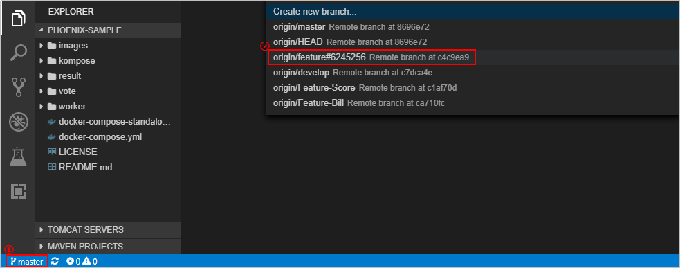

          

    3.  打开文件“vote/templates/store-network.html“，添加北京分店地址。

        ```
        <ul>
        	<li>北京分店：首都机场1号航站楼出发层靠右直行888米左右右侧</li>
        </ul>
        ```

        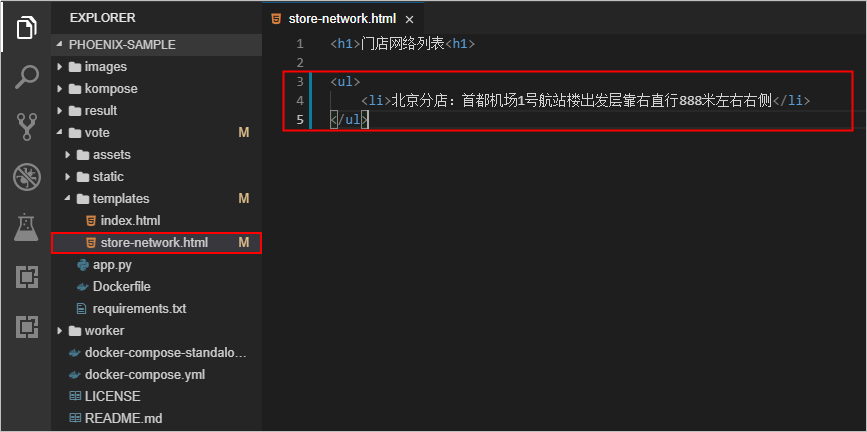

          

    4.  打开文件“vote/templates/index.html“，将179行中“门店网络“菜单连接到“store-network“。

        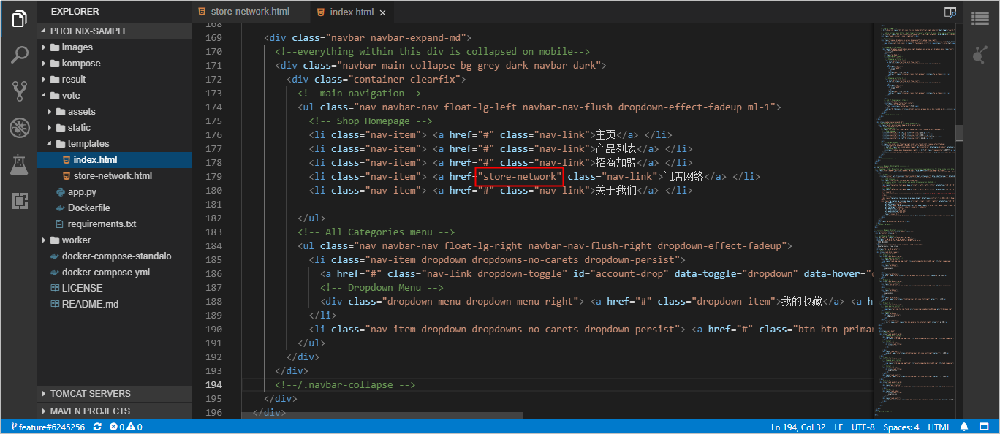

          

    5.  参考[01使用CloudIDE修改和提交代码-步骤5](#li7319628103519)操作，将修改的代码推送至代码仓库。

-   **使用Git在本地进行新功能开发（选做）**
    1.  本地打开Git客户端，使用git pull命令拉取最新代码。

        ```
        git pull 
        ```

    2.  使用git checkout命令切换分支。

        ```
        git checkout 分支名
        ```

    3.  使用git branch命令，查看当前分支。

        ```
        git branch 
        ```

    4.  参照，使用本地IDE修改代码后，使用Git客户端输入以下命令提交代码。

        ```
        git add . 
        git commit -m "fix #工作项编码 本次提交的注释信息" 
        git push
        ```


-   <a name="li1320712584219"></a>**创建合并请求**
    1.  进入代码仓库，选择“合并请求“页签，单击“新建合并请求“。

        -   源分支选择刚刚创建的分支，与目标分支选择“master“，单击“下一步“。
        -   输入标题、描述（选填），选择合并人、评审人，单击“确定“完成。

        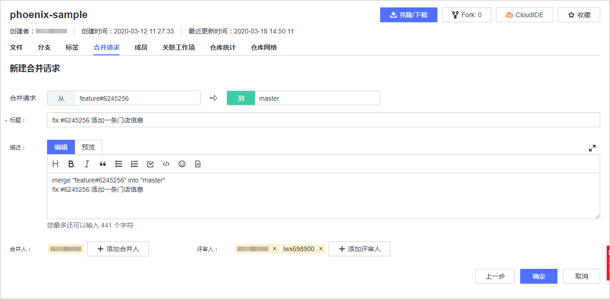

        > **说明：**   
        >-   “合并人“即接受合并请求的人，“评审人“是由合并发起人邀请参与的评审者。  
        >-   对于不合格的合并请求，管理员可以关闭。在评分不够时，无法完成该合并请求。  


-   **代码检视以及评分**
    1.  **评审人**进入代码仓库后，在“合并请求“页签中找到需要评审的合并请求，单击该请求，查看合并请求详情。
    2.  评审者可以在“合并请求详情“页签中发表评论、发表讨论，对合并请求进行评分。

        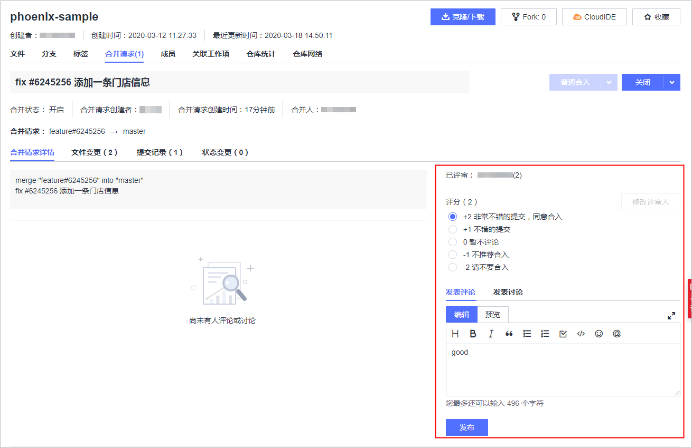

          

        也可以在文件变更页签，针对某一行代码发表讨论。

        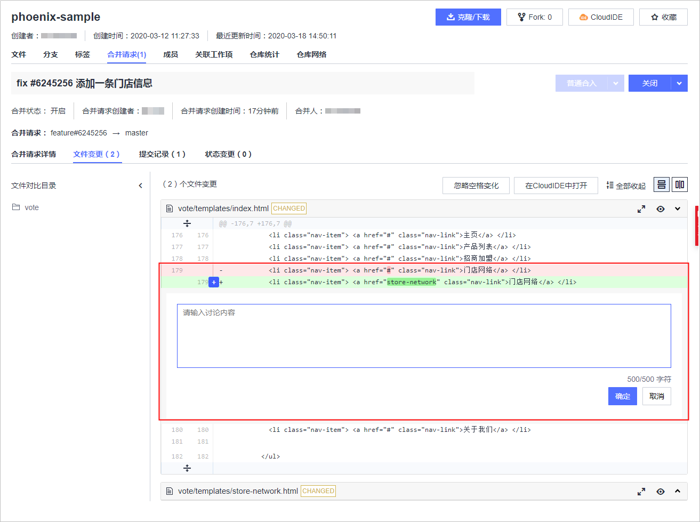

          

        > **说明：**   
        >评论与讨论的区别在于：评论无需回复并解决。而讨论是一个需要解决的问题。在评论记录里，可以看到差别。  

          

    3.  **开发人员**在“合并请求详情“页面可查评论/讨论记录。

        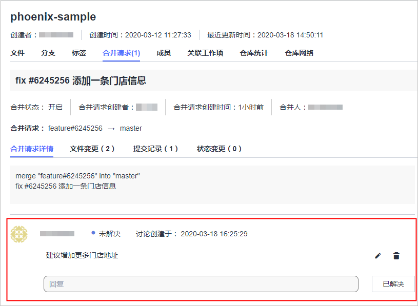

          

        用**CloudIDE**打开代码仓库，根据建议修改代码，并参考[01使用CloudIDE修改和提交代码-步骤5](#li7319628103519)操作，将修改的代码推送至代码仓库。

        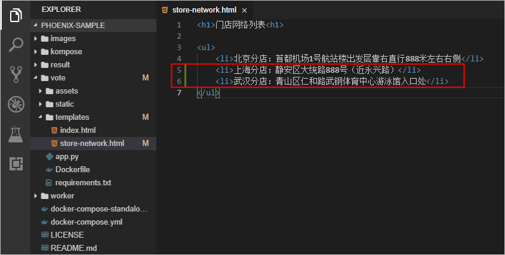

          

        返回**代码仓库**，在讨论详情中输入回复信息，并单击“回复并解决“。

        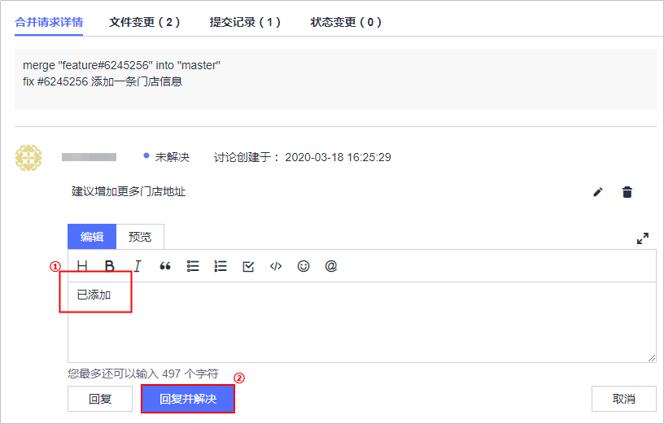

          

    4.  使用另一账号提交评分。

        若只有一个账号，请将允许分支合并的最低评分设置为2分，设置方式参见[•管理分支合并策略](#li050856144112)。

    5.  **合并人**进入代码仓库后，在“合并请求“页签中找到需要评审的合并请求，单击该请求，查看合并请求详情。

        选择“删除源分支合入“，系统将提示“合并成功“。

        

          

    6.  此时，单击“分支“页签，分支列表中将不再显示在[•创建合并请求](#li1320712584219)中选择的源分支。


## **04.使用代码托管的高级管理功能**<a name="section4400168"></a>

代码托管服务提供了以下功能，能够满足更多的使用场景。

<a name="table1496717644316"></a>
<table><thead align="left"><tr id="row1296706184314"><th class="cellrowborder" valign="top" width="20%" id="mcps1.1.3.1.1"><p id="p296711614432"><a name="p296711614432"></a><a name="p296711614432"></a><strong id="b9449815194310"><a name="b9449815194310"></a><a name="b9449815194310"></a>功能</strong></p>
</th>
<th class="cellrowborder" valign="top" width="80%" id="mcps1.1.3.1.2"><p id="p7967262434"><a name="p7967262434"></a><a name="p7967262434"></a><strong id="b6451915184315"><a name="b6451915184315"></a><a name="b6451915184315"></a>说明</strong></p>
</th>
</tr>
</thead>
<tbody><tr id="row1396710604314"><td class="cellrowborder" valign="top" width="20%" headers="mcps1.1.3.1.1 "><p id="p79673634320"><a name="p79673634320"></a><a name="p79673634320"></a><a href="https://support.huaweicloud.com/usermanual-codehub/devcloud_hlp_00074.html" target="_blank" rel="noopener noreferrer">仓库统计</a></p>
</td>
<td class="cellrowborder" valign="top" width="80%" headers="mcps1.1.3.1.2 "><p id="p189677624314"><a name="p189677624314"></a><a name="p189677624314"></a>可以查看代码贡献量、提交记录、频率、涉及语言等信息。</p>
</td>
</tr>
<tr id="row199671866434"><td class="cellrowborder" valign="top" width="20%" headers="mcps1.1.3.1.1 "><p id="p696717611431"><a name="p696717611431"></a><a name="p696717611431"></a><a href="https://support.huaweicloud.com/usermanual-codehub/devcloud_hlp_0734.html" target="_blank" rel="noopener noreferrer">IP白名单</a></p>
</td>
<td class="cellrowborder" valign="top" width="80%" headers="mcps1.1.3.1.2 "><p id="p796714624320"><a name="p796714624320"></a><a name="p796714624320"></a><span>只有在IP白名单范围内的仓库访问才是允许的，除此之外其他IP发起的访问一律被拒绝。</span></p>
</td>
</tr>
<tr id="row169675617432"><td class="cellrowborder" valign="top" width="20%" headers="mcps1.1.3.1.1 "><p id="p1396714664317"><a name="p1396714664317"></a><a name="p1396714664317"></a><a href="https://support.huaweicloud.com/usermanual-codehub/codehub_ug_1001.html" target="_blank" rel="noopener noreferrer">子模块设置</a></p>
</td>
<td class="cellrowborder" valign="top" width="80%" headers="mcps1.1.3.1.2 "><p id="p159671268433"><a name="p159671268433"></a><a name="p159671268433"></a><span>Git为管理仓库共用而衍生出的一个工具</span>。<span>通过子模块您可以将公共仓库作为子目录包含到您的仓库中，并能够双向更新该公共仓库的代码</span>。</p>
</td>
</tr>
<tr id="row196712611430"><td class="cellrowborder" valign="top" width="20%" headers="mcps1.1.3.1.1 "><p id="p29686654316"><a name="p29686654316"></a><a name="p29686654316"></a><a href="https://support.huaweicloud.com/usermanual-codehub/codehub_ug_0222.html" target="_blank" rel="noopener noreferrer">WebHook设置</a></p>
</td>
<td class="cellrowborder" valign="top" width="80%" headers="mcps1.1.3.1.2 "><p id="p1296886154317"><a name="p1296886154317"></a><a name="p1296886154317"></a><span>WebHook允许开发人员通过订阅 CodeHub 的仓库的分支推送(push)，标签推送(tag push)等事件来触发自己系统的构建、更新镜像、部署等操作。</span></p>
</td>
</tr>
<tr id="row996811619431"><td class="cellrowborder" valign="top" width="20%" headers="mcps1.1.3.1.1 "><p id="p1622485304915"><a name="p1622485304915"></a><a name="p1622485304915"></a>通知设置</p>
</td>
<td class="cellrowborder" valign="top" width="80%" headers="mcps1.1.3.1.2 "><p id="p1096876114314"><a name="p1096876114314"></a><a name="p1096876114314"></a><span>当仓库发生重大变更（例如删除、冻结）时，系统会发送邮件通知。通过</span><span class="menucascade" id="menucascade23911454175913"><a name="menucascade23911454175913"></a><a name="menucascade23911454175913"></a>“<span class="uicontrol" id="uicontrol6391554155918"><a name="uicontrol6391554155918"></a><a name="uicontrol6391554155918"></a>设置</span> &gt; <span class="uicontrol" id="uicontrol20119656105914"><a name="uicontrol20119656105914"></a><a name="uicontrol20119656105914"></a>基础设置</span> &gt; <span class="uicontrol" id="uicontrol14278907013"><a name="uicontrol14278907013"></a><a name="uicontrol14278907013"></a>通知设置</span>”</span><span>页面，可设置接收者范围。</span></p>
</td>
</tr>
</tbody>
</table>

  

