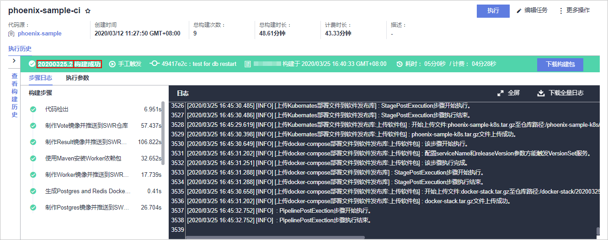
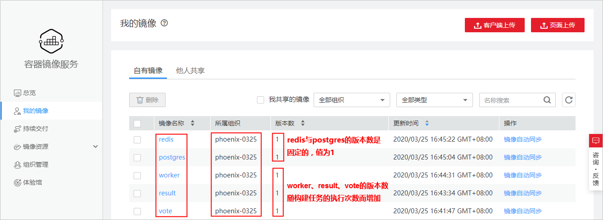
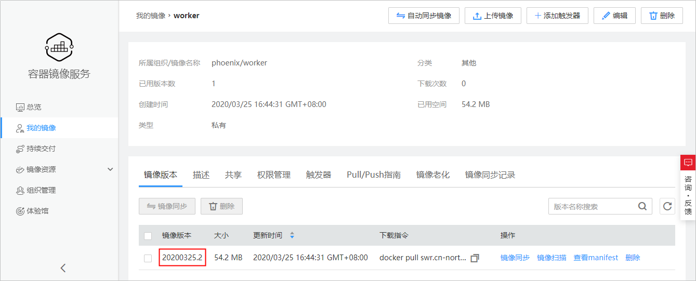
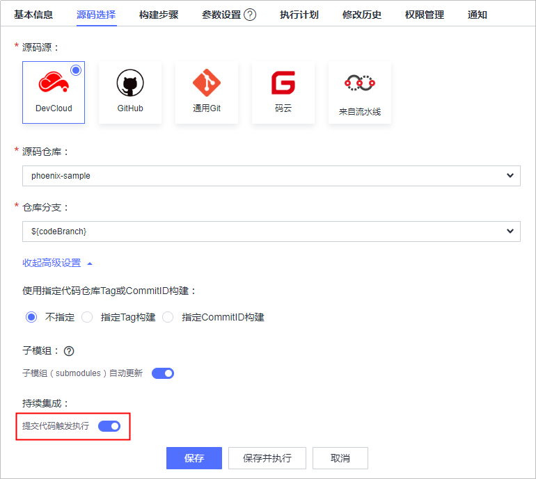
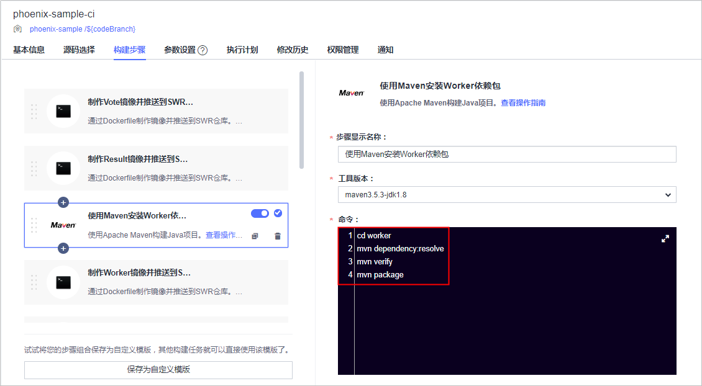
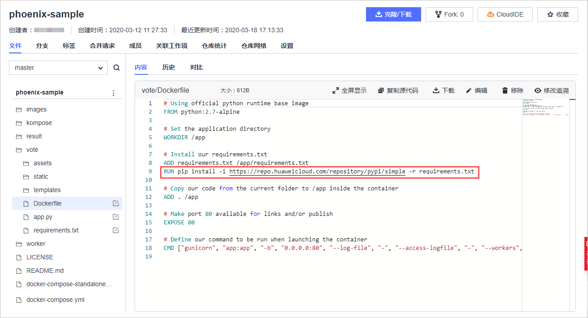
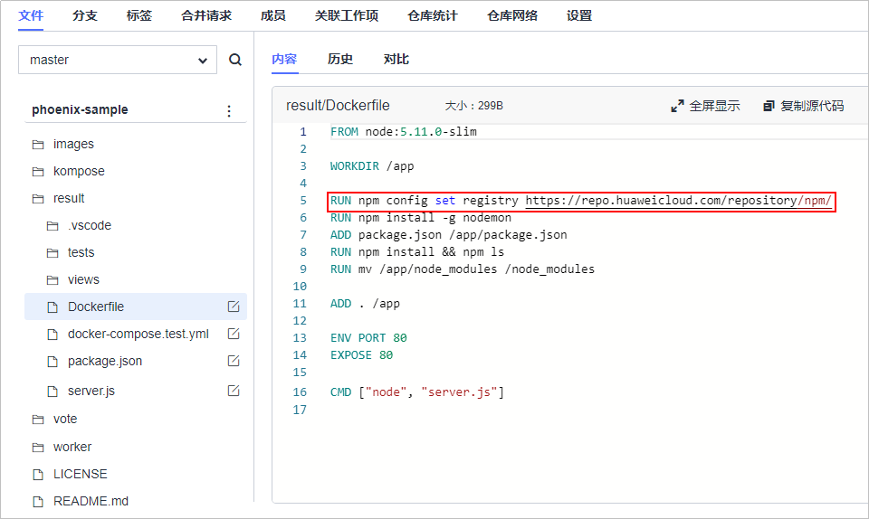
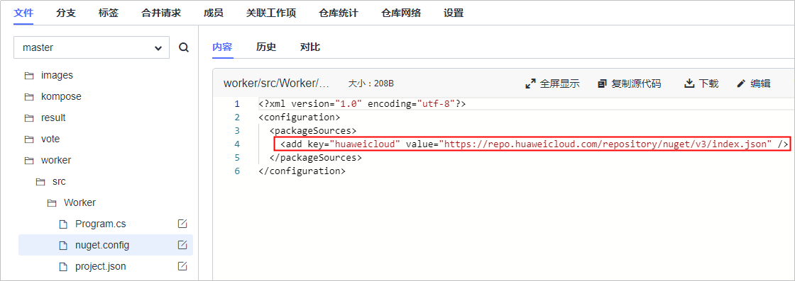

# **使用持续集成，加快代码质量反馈速度**<a name="devcloud_practice_2006"></a>

## **背景**<a name="section51797270"></a>

```
克里斯（应用程序开发副总裁）：最近一次部署又出问题了，居然是因为我们的JDK版本升级了，在环境清单里没有标示清楚，运维的兄弟气疯了。
我跟比尔一起聊了下，达到了如下共识：
首先开发部跟运维部应该紧密合作，建立共同的目标和共同解决问题的机制。
开发的工作与运维的工作应该解耦，运维更多是将IT运维任务转变为自助、自动化服务，把基础架构的配置能力交给开发，因为没有人比我们更清楚应用的运行环境。
我们需要保证每个环境（开发调测环境、测试环境、QA环境、生产环境）都保持一致， 避免因为环境不一致导致的各种问题。后面统一使用Docker的方式将应用与环境统一打包到镜像保持环境一致。
我们还需要持续不断的对应用进行验证，确保应用总是处于可部署的状态并建立持续反馈回路，防止问题代码进入生产环境。
```

样例项目中预置了以下5个编译构建任务，本章节以任务“phoenix-codecheck-worker“为例进行讲解。

<a name="table11691548568"></a>
<table><thead align="left"><tr id="row51691481065"><th class="cellrowborder" valign="top" width="25%" id="mcps1.1.3.1.1"><p id="p31694485618"><a name="p31694485618"></a><a name="p31694485618"></a><strong id="b734511581767"><a name="b734511581767"></a><a name="b734511581767"></a>预置编译构建任务</strong></p>
</th>
<th class="cellrowborder" valign="top" width="75%" id="mcps1.1.3.1.2"><p id="p7169194811614"><a name="p7169194811614"></a><a name="p7169194811614"></a><strong id="b15129419718"><a name="b15129419718"></a><a name="b15129419718"></a>任务说明</strong></p>
</th>
</tr>
</thead>
<tbody><tr id="row27811623104211"><td class="cellrowborder" valign="top" width="25%" headers="mcps1.1.3.1.1 "><p id="p89521428144220"><a name="p89521428144220"></a><a name="p89521428144220"></a>phoenix-sample-ci</p>
</td>
<td class="cellrowborder" valign="top" width="75%" headers="mcps1.1.3.1.2 "><p id="p1195292814216"><a name="p1195292814216"></a><a name="p1195292814216"></a>基本的编译构建任务。</p>
</td>
</tr>
<tr id="row1563171711427"><td class="cellrowborder" valign="top" width="25%" headers="mcps1.1.3.1.1 "><p id="p51706487612"><a name="p51706487612"></a><a name="p51706487612"></a>phoenix-sample-ci-test</p>
</td>
<td class="cellrowborder" valign="top" width="75%" headers="mcps1.1.3.1.2 "><p id="p7170114816618"><a name="p7170114816618"></a><a name="p7170114816618"></a>测试环境对应的编译构建任务。</p>
</td>
</tr>
<tr id="row10169164815619"><td class="cellrowborder" valign="top" width="25%" headers="mcps1.1.3.1.1 "><p id="p19452114274112"><a name="p19452114274112"></a><a name="p19452114274112"></a>phoenix-sample-ci-worker</p>
</td>
<td class="cellrowborder" valign="top" width="75%" headers="mcps1.1.3.1.2 "><p id="p717017481762"><a name="p717017481762"></a><a name="p717017481762"></a>worker功能对应的编译构建任务。</p>
</td>
</tr>
<tr id="row1217014480615"><td class="cellrowborder" valign="top" width="25%" headers="mcps1.1.3.1.1 "><p id="p517015481762"><a name="p517015481762"></a><a name="p517015481762"></a>phoenix-sample-ci-result</p>
</td>
<td class="cellrowborder" valign="top" width="75%" headers="mcps1.1.3.1.2 "><p id="p111708481361"><a name="p111708481361"></a><a name="p111708481361"></a>result功能对应的编译构建任务。</p>
</td>
</tr>
<tr id="row31709481564"><td class="cellrowborder" valign="top" width="25%" headers="mcps1.1.3.1.1 "><p id="p117064813612"><a name="p117064813612"></a><a name="p117064813612"></a>phoenix-sample-ci-vote</p>
</td>
<td class="cellrowborder" valign="top" width="75%" headers="mcps1.1.3.1.2 "><p id="p111704485610"><a name="p111704485610"></a><a name="p111704485610"></a>vote功能对应的编译构建任务。</p>
</td>
</tr>
</tbody>
</table>

> **说明：**   
>关于vote、result、worker的说明，请参见[HE2E DevOps实践流程](HE2E-DevOps实践流程.md)。  

## **使用自动化编译提高代码质量验证速度**<a name="section34829302"></a>

通过本节，您将学习如何通过**编译构建**服务完成应用的Docker镜像打包以及推送。

-   **查看编译构建任务**

    进入项目，单击页面上方导航“构建&发布  \>  编译构建“，进入编译构建服务。

    找到编译构建任务“phoenix-sample-ci“，单击此任务对应操作列中的图标，进入“编译构建编辑任务“页面。

    -   在可查看或编辑以下内容：

        <a name="table164421538171118"></a>
        <table><thead align="left"><tr id="row164421381113"><th class="cellrowborder" valign="top" width="25%" id="mcps1.1.3.1.1"><p id="p6884125610114"><a name="p6884125610114"></a><a name="p6884125610114"></a><strong id="b481195816117"><a name="b481195816117"></a><a name="b481195816117"></a>页签</strong></p>
        </th>
        <th class="cellrowborder" valign="top" width="75%" id="mcps1.1.3.1.2"><p id="p10884145612112"><a name="p10884145612112"></a><a name="p10884145612112"></a><strong id="b982865813114"><a name="b982865813114"></a><a name="b982865813114"></a>说明</strong></p>
        </th>
        </tr>
        </thead>
        <tbody><tr id="row13442163861115"><td class="cellrowborder" valign="top" width="25%" headers="mcps1.1.3.1.1 "><p id="p989918615128"><a name="p989918615128"></a><a name="p989918615128"></a>基本信息</p>
        </td>
        <td class="cellrowborder" valign="top" width="75%" headers="mcps1.1.3.1.2 "><p id="p18995611211"><a name="p18995611211"></a><a name="p18995611211"></a>编辑任务名称、描述。</p>
        </td>
        </tr>
        <tr id="row174421638191118"><td class="cellrowborder" valign="top" width="25%" headers="mcps1.1.3.1.1 "><p id="p98993612125"><a name="p98993612125"></a><a name="p98993612125"></a>源码选择</p>
        </td>
        <td class="cellrowborder" valign="top" width="75%" headers="mcps1.1.3.1.2 "><p id="p98991365125"><a name="p98991365125"></a><a name="p98991365125"></a>设置源码源、源码仓库、分支、子模组等信息。</p>
        <p id="p789917619125"><a name="p789917619125"></a><a name="p789917619125"></a>分支内容可直接填写分支名称，如master；也可填写调用的分支参数名称，调用格式为${参数名称}。</p>
        </td>
        </tr>
        <tr id="row1244263821117"><td class="cellrowborder" valign="top" width="25%" headers="mcps1.1.3.1.1 "><p id="p1289912617128"><a name="p1289912617128"></a><a name="p1289912617128"></a>构建步骤</p>
        </td>
        <td class="cellrowborder" valign="top" width="75%" headers="mcps1.1.3.1.2 "><p id="p48990631212"><a name="p48990631212"></a><a name="p48990631212"></a>配置构建步骤、步骤参数。</p>
        </td>
        </tr>
        <tr id="row1442193818111"><td class="cellrowborder" valign="top" width="25%" headers="mcps1.1.3.1.1 "><p id="p98992616124"><a name="p98992616124"></a><a name="p98992616124"></a>参数设置</p>
        </td>
        <td class="cellrowborder" valign="top" width="75%" headers="mcps1.1.3.1.2 "><p id="p1189912616123"><a name="p1189912616123"></a><a name="p1189912616123"></a>配置执行任务时的自定义参数。</p>
        </td>
        </tr>
        <tr id="row3442193810119"><td class="cellrowborder" valign="top" width="25%" headers="mcps1.1.3.1.1 "><p id="p118998641212"><a name="p118998641212"></a><a name="p118998641212"></a>执行计划</p>
        </td>
        <td class="cellrowborder" valign="top" width="75%" headers="mcps1.1.3.1.2 "><p id="p178992612123"><a name="p178992612123"></a><a name="p178992612123"></a>配置构建任务的执行时间。</p>
        </td>
        </tr>
        <tr id="row20442173820115"><td class="cellrowborder" valign="top" width="25%" headers="mcps1.1.3.1.1 "><p id="p98993613125"><a name="p98993613125"></a><a name="p98993613125"></a>修改历史</p>
        </td>
        <td class="cellrowborder" valign="top" width="75%" headers="mcps1.1.3.1.2 "><p id="p1189919651211"><a name="p1189919651211"></a><a name="p1189919651211"></a>查看任务的历史修改记录。</p>
        </td>
        </tr>
        <tr id="row11442113851112"><td class="cellrowborder" valign="top" width="25%" headers="mcps1.1.3.1.1 "><p id="p1589946171212"><a name="p1589946171212"></a><a name="p1589946171212"></a>权限管理</p>
        </td>
        <td class="cellrowborder" valign="top" width="75%" headers="mcps1.1.3.1.2 "><p id="p1989996121210"><a name="p1989996121210"></a><a name="p1989996121210"></a>配置不同项目角色的操作权限。</p>
        </td>
        </tr>
        <tr id="row204944217120"><td class="cellrowborder" valign="top" width="25%" headers="mcps1.1.3.1.1 "><p id="p108991560127"><a name="p108991560127"></a><a name="p108991560127"></a>通知</p>
        </td>
        <td class="cellrowborder" valign="top" width="75%" headers="mcps1.1.3.1.2 "><p id="p188992064127"><a name="p188992064127"></a><a name="p188992064127"></a>配置各种事件类型的通知方式。</p>
        </td>
        </tr>
        </tbody>
        </table>

    -   编译构建任务包含以下构建步骤（实际操作中保持默认设置即可）：

        <a name="table044518941318"></a>
        <table><thead align="left"><tr id="row17445695132"><th class="cellrowborder" valign="top" width="25%" id="mcps1.1.3.1.1"><p id="p1944509131319"><a name="p1944509131319"></a><a name="p1944509131319"></a><strong id="b9345193136"><a name="b9345193136"></a><a name="b9345193136"></a>构建步骤</strong></p>
        </th>
        <th class="cellrowborder" valign="top" width="75%" id="mcps1.1.3.1.2"><p id="p194456916137"><a name="p194456916137"></a><a name="p194456916137"></a><strong id="b142972059260"><a name="b142972059260"></a><a name="b142972059260"></a>说明</strong></p>
        </th>
        </tr>
        </thead>
        <tbody><tr id="row544514910131"><td class="cellrowborder" valign="top" width="25%" headers="mcps1.1.3.1.1 "><p id="p744517915132"><a name="p744517915132"></a><a name="p744517915132"></a>制作Vote镜像并推送到SWR仓库</p>
        </td>
        <td class="cellrowborder" valign="top" width="75%" headers="mcps1.1.3.1.2 "><p id="p121521949202210"><a name="p121521949202210"></a><a name="p121521949202210"></a>通过路径“<em id="i141524495223"><a name="i141524495223"></a><a name="i141524495223"></a>工作目录</em>./vote”及“<em id="i1715219493228"><a name="i1715219493228"></a><a name="i1715219493228"></a>Dockerfile路径</em>./Dockerfile”找到Dockerfile文件，依据Dockerfile文件制作并推送Vote功能镜像。</p>
        </td>
        </tr>
        <tr id="row1144569101316"><td class="cellrowborder" valign="top" width="25%" headers="mcps1.1.3.1.1 "><p id="p744516921317"><a name="p744516921317"></a><a name="p744516921317"></a>制作Result镜像并推送到SWR仓库</p>
        </td>
        <td class="cellrowborder" valign="top" width="75%" headers="mcps1.1.3.1.2 "><p id="p16513183142518"><a name="p16513183142518"></a><a name="p16513183142518"></a>通过路径“工作目录./result”及“Dockerfile路径./Dockerfile”找到Dockerfile文件，依据Dockerfile文件制作并推送Result功能镜像。</p>
        </td>
        </tr>
        <tr id="row1144512951316"><td class="cellrowborder" valign="top" width="25%" headers="mcps1.1.3.1.1 "><p id="p11445494139"><a name="p11445494139"></a><a name="p11445494139"></a>使用Maven安装Worker依赖包</p>
        </td>
        <td class="cellrowborder" valign="top" width="75%" headers="mcps1.1.3.1.2 "><p id="p11445119191313"><a name="p11445119191313"></a><a name="p11445119191313"></a>使用Maven安装Worker功能所需的依赖</p>
        </td>
        </tr>
        <tr id="row12445189181312"><td class="cellrowborder" valign="top" width="25%" headers="mcps1.1.3.1.1 "><p id="p15445159101320"><a name="p15445159101320"></a><a name="p15445159101320"></a>制作Worker镜像并推送到SWR仓库</p>
        </td>
        <td class="cellrowborder" valign="top" width="75%" headers="mcps1.1.3.1.2 "><p id="p1271216215253"><a name="p1271216215253"></a><a name="p1271216215253"></a>通过路径“工作目录./worker”及“Dockerfile路径Dockerfile.j2”找到Dockerfile文件，依据Dockerfile文件制作并推送Worker功能镜像。</p>
        </td>
        </tr>
        <tr id="row15445159161316"><td class="cellrowborder" valign="top" width="25%" headers="mcps1.1.3.1.1 "><p id="p344529131313"><a name="p344529131313"></a><a name="p344529131313"></a>生成Postgres and Redis Dockerfile</p>
        </td>
        <td class="cellrowborder" valign="top" width="75%" headers="mcps1.1.3.1.2 "><p id="p844579131312"><a name="p844579131312"></a><a name="p844579131312"></a>通过Shell命令生成Postgres和Redis的Dockerfile文件。Redis和Postgres分别是缓存和数据库。</p>
        </td>
        </tr>
        <tr id="row1744518915134"><td class="cellrowborder" valign="top" width="25%" headers="mcps1.1.3.1.1 "><p id="p16445695132"><a name="p16445695132"></a><a name="p16445695132"></a>制作Postgres镜像并推送到SWR仓库</p>
        </td>
        <td class="cellrowborder" valign="top" width="75%" headers="mcps1.1.3.1.2 "><p id="p1644513913130"><a name="p1644513913130"></a><a name="p1644513913130"></a>通过“工作目录.”及“Dockerfile路径./Dockerfile-postgres”找到Dockerfile文件，依据Dockerfile文件制作并推送Postgres镜像。</p>
        </td>
        </tr>
        <tr id="row5445139121319"><td class="cellrowborder" valign="top" width="25%" headers="mcps1.1.3.1.1 "><p id="p16445199181317"><a name="p16445199181317"></a><a name="p16445199181317"></a>制作Redis镜像并推送到SWR仓库</p>
        </td>
        <td class="cellrowborder" valign="top" width="75%" headers="mcps1.1.3.1.2 "><p id="p2044529131320"><a name="p2044529131320"></a><a name="p2044529131320"></a>通过“工作目录.”及“Dockerfile路径./Dockerfile-redis”找到Dockerfile文件，依据Dockerfile文件制作并推送Redis功能镜像。</p>
        </td>
        </tr>
        <tr id="row1139065981520"><td class="cellrowborder" valign="top" width="25%" headers="mcps1.1.3.1.1 "><p id="p10390175911517"><a name="p10390175911517"></a><a name="p10390175911517"></a>替换Docker-Compose部署文件镜像版本</p>
        </td>
        <td class="cellrowborder" valign="top" width="75%" headers="mcps1.1.3.1.2 "><p id="p2437151618283"><a name="p2437151618283"></a><a name="p2437151618283"></a>首先，将文件<strong id="b179815823016"><a name="b179815823016"></a><a name="b179815823016"></a>docker-compose-standalone.yml</strong>中的参数<strong id="b214181333020"><a name="b214181333020"></a><a name="b214181333020"></a>docker-server</strong>、<strong id="b183728319304"><a name="b183728319304"></a><a name="b183728319304"></a>docker-org</strong>、<strong id="b123063603018"><a name="b123063603018"></a><a name="b123063603018"></a>image-version</strong>依次用构建任务当中的参数<strong id="b11784353011"><a name="b11784353011"></a><a name="b11784353011"></a>dockerServer</strong>、<strong id="b16656547133018"><a name="b16656547133018"></a><a name="b16656547133018"></a>dockerOrg</strong>、<strong id="b1858095233011"><a name="b1858095233011"></a><a name="b1858095233011"></a>BuildNumber</strong>进行替换，以便后续进行ECS部署时可以拉取到正确的镜像。</p>
        <p id="p1271213568276"><a name="p1271213568276"></a><a name="p1271213568276"></a>然后，使用tar命令将文件<strong id="b1234441143120"><a name="b1234441143120"></a><a name="b1234441143120"></a>docker-compose-standalone.yml</strong>压缩为<strong id="b14740183373113"><a name="b14740183373113"></a><a name="b14740183373113"></a>docker-stack.tar.gz</strong>，将部署所需文件进行打包，以便于后续步骤将该文件上传归档。</p>
        </td>
        </tr>
        <tr id="row156426590155"><td class="cellrowborder" valign="top" width="25%" headers="mcps1.1.3.1.1 "><p id="p19642205911157"><a name="p19642205911157"></a><a name="p19642205911157"></a>替换Kubernates部署文件镜像版本</p>
        </td>
        <td class="cellrowborder" valign="top" width="75%" headers="mcps1.1.3.1.2 "><p id="p75143503337"><a name="p75143503337"></a><a name="p75143503337"></a>首先，将在目录<strong id="b18514105020330"><a name="b18514105020330"></a><a name="b18514105020330"></a>kompose</strong>下，所有以<strong id="b155141650173312"><a name="b155141650173312"></a><a name="b155141650173312"></a>deployment</strong>结尾的文件中，参数<strong id="b10514185053319"><a name="b10514185053319"></a><a name="b10514185053319"></a>docker-server</strong>、<strong id="b205143503332"><a name="b205143503332"></a><a name="b205143503332"></a>docker-org、image-version</strong>依次用构建任务当中的参数<strong id="b2514195018331"><a name="b2514195018331"></a><a name="b2514195018331"></a>dockerServer</strong>、<strong id="b151418509334"><a name="b151418509334"></a><a name="b151418509334"></a>dockerOrg</strong>进行替换，以便后续进行CCE部署时可以拉取到正确的镜像。</p>
        <p id="p7642165981519"><a name="p7642165981519"></a><a name="p7642165981519"></a>然后，使用tar命令将整个<strong id="b18576145919333"><a name="b18576145919333"></a><a name="b18576145919333"></a>kompose</strong>目录压缩为<strong id="b137865333413"><a name="b137865333413"></a><a name="b137865333413"></a>phoenix-sample-k8s.tar.gz</strong>，将部署所需文件进行打包，以便于后续步骤将该文件上传归档。</p>
        </td>
        </tr>
        <tr id="row583685941518"><td class="cellrowborder" valign="top" width="25%" headers="mcps1.1.3.1.1 "><p id="p1483725911155"><a name="p1483725911155"></a><a name="p1483725911155"></a>上传Kubernates部署文件到软件发布库</p>
        </td>
        <td class="cellrowborder" valign="top" width="75%" headers="mcps1.1.3.1.2 "><p id="p383712592157"><a name="p383712592157"></a><a name="p383712592157"></a>将之前压缩好的<strong id="b3609124843219"><a name="b3609124843219"></a><a name="b3609124843219"></a>phoenix-sample-k8s.tar.gz</strong>（构建包路径）上传到软件发布库中归档，包名命名为<strong id="b1588651103219"><a name="b1588651103219"></a><a name="b1588651103219"></a>phoenix-sample-k8s</strong>，实现软件包的版本管理。</p>
        </td>
        </tr>
        <tr id="row17372019168"><td class="cellrowborder" valign="top" width="25%" headers="mcps1.1.3.1.1 "><p id="p103770121618"><a name="p103770121618"></a><a name="p103770121618"></a>上传docker-compose部署文件到软件发布库</p>
        </td>
        <td class="cellrowborder" valign="top" width="75%" headers="mcps1.1.3.1.2 "><p id="p133711017168"><a name="p133711017168"></a><a name="p133711017168"></a>将之前压缩好的<strong id="b8285114213215"><a name="b8285114213215"></a><a name="b8285114213215"></a>docker-stack.tar.gz</strong>（构建包路径）上传到软件发布库中归档，包名命名为<strong id="b89541544123211"><a name="b89541544123211"></a><a name="b89541544123211"></a>docker-stack</strong>，实现软件包的版本管理。</p>
        </td>
        </tr>
        </tbody>
        </table>


-   **编辑并执行编译构建任务**

    编译构建任务需要使用到**容器镜像服务（SWR）**，因此需要首先配置SWR服务，然后配置编译构建任务并执行。

    1.  登录[容器镜像服务控制台](https://console.huaweicloud.com/swr/?region=#/app/dashboard)。

        请检查页面左上方的“区域“列表，请确保与编译构建任务所在区相同的区域。若区域不同，请选择相同区域。

    2.  <a name="li136740329382"></a>单击“登录指令“，系统生成并弹框显示docker login指令。

        指令中，**-u**之后的字符串为用户名，**-p**之后的字符串为密码。最后的字符串为SWR服务器地址，此地址即为后续[步骤5](#li147791939121913)中的参数dockerServer。

        

          

    3.  <a name="li146813520520"></a>在左侧导航栏中选择“组织管理“，进入“组织管理“页面。

        单击“创建组织“，在弹框中输入组织名称“phoenix“（或自定义，此名称全局唯一），单击“确定“保存。

        这里的组织名称，即为后续[步骤5](#li147791939121913)中的参数dockerOrg。

        

          

    4.  返回DevCloud，进入项目，单击页面上方导航“构建&发布  \>  编译构建“，进入编译构建服务。

        找到编译构建任务“phoenix-sample-ci“，单击此任务对应操作列中的图标，进入“编译构建编辑任务“页面。

    5.  <a name="li147791939121913"></a>选择“参数设置“页签，编辑以下两个参数。

        -   dockerOrg：输入在[步骤3](#li146813520520)中创建的组织。
        -   dockerServer：输入在[步骤2](#li136740329382)中记录的内容。

        

          

        > **说明：**   
        >请务必确保这参数dockerOrg、dockerServer的输入值是正确的。  

    6.  <a name="li861220121014"></a>单击“保存并执行“，启动编译构建任务。

        系统自动跳转至“编译详情“页面，可以查看任务执行进展。

        当出现以下页面时，表示任务执行成功。

        请记录“构建成功“字样前面的数字串，该数字串为构建任务中的系统预定义参数BuildNumber，在后续[步骤9](#li1396115457156)查看镜像详情中，镜像版本即此数字串。

        

          

        > **说明：**   
        >1.  初次执行时构建时间较长，后续一般执行时长约为4-6分钟。  
        >2.  若构建失败，请仔细检查参数dockerOrg、dockerServer的设置是否正确。  

    7.  单击页面上方导航“构建&发布  \>  发布“，进入发布服务。

        列表中可找到下图所示的两个文件夹。

        

          

    8.  进入SWR控制台，在页面左侧导航选择“我的镜像“。

        列表中可看到5个镜像，镜像的所属组织为[步骤3](#li146813520520)中创建的组织，版本数如下图所示。

        

          

    9.  <a name="li1396115457156"></a>在列表中单击“worker“查看镜像详情。

        在镜像列表页签中找到最新版本镜像，镜像版本与最新一次构建任务的执行编号一致，执行编号的查看方法请参考[步骤6](#li861220121014)。

        

          


## **配置持续集成并通过提交代码触发自动化编译**<a name="section45028263"></a>

通过本节，您将学习如何启动持续集成，实现代码变更后自动触发应用的Docker镜像打包以及推送。

-   **持续集成配置**
    1.  进入编译构建任务“phoenix-sample-ci“的“编译构建编辑任务“页面，

        选择“源码选择“页签，单击“高级设置“。

        单击“提交代码触发执行“后的图标，打开开关，单击“保存“。

        

          

    2.  设置完成后，当有代码变更时，将自动触发该任务。


-   **持续集成执行计划配置**
    1.  进入编译构建任务“phoenix-sample-ci“的“编译构建编辑任务“页面。
    2.  选择“执行计划“页签，根据需要设置执行计划，单击“保存“。

        执行计划包括以下三种：

        <a name="table171091374354"></a>
        <table><thead align="left"><tr id="row41091437173518"><th class="cellrowborder" valign="top" width="25%" id="mcps1.1.3.1.1"><p id="p2109537123519"><a name="p2109537123519"></a><a name="p2109537123519"></a><strong id="b6621746203520"><a name="b6621746203520"></a><a name="b6621746203520"></a>执行计划</strong></p>
        </th>
        <th class="cellrowborder" valign="top" width="75%" id="mcps1.1.3.1.2"><p id="p0109143713358"><a name="p0109143713358"></a><a name="p0109143713358"></a><strong id="b283146193511"><a name="b283146193511"></a><a name="b283146193511"></a>说明</strong></p>
        </th>
        </tr>
        </thead>
        <tbody><tr id="row1510973714351"><td class="cellrowborder" valign="top" width="25%" headers="mcps1.1.3.1.1 "><p id="p553511623615"><a name="p553511623615"></a><a name="p553511623615"></a>手工执行</p>
        </td>
        <td class="cellrowborder" valign="top" width="75%" headers="mcps1.1.3.1.2 "><p id="p6109637133519"><a name="p6109637133519"></a><a name="p6109637133519"></a>手动触发任务执行。</p>
        </td>
        </tr>
        <tr id="row9109183723510"><td class="cellrowborder" valign="top" width="25%" headers="mcps1.1.3.1.1 "><p id="p953571617369"><a name="p953571617369"></a><a name="p953571617369"></a>每日定时执行</p>
        </td>
        <td class="cellrowborder" valign="top" width="75%" headers="mcps1.1.3.1.2 "><p id="p61091371354"><a name="p61091371354"></a><a name="p61091371354"></a>设置<span class="parmname" id="parmname19721115919365"><a name="parmname19721115919365"></a><a name="parmname19721115919365"></a>“执行开始时间”</span>后，任务每天在此时间启动执行。</p>
        </td>
        </tr>
        <tr id="row13109137173512"><td class="cellrowborder" valign="top" width="25%" headers="mcps1.1.3.1.1 "><p id="p55351016143615"><a name="p55351016143615"></a><a name="p55351016143615"></a>每周定时执行</p>
        </td>
        <td class="cellrowborder" valign="top" width="75%" headers="mcps1.1.3.1.2 "><p id="p1610933733514"><a name="p1610933733514"></a><a name="p1610933733514"></a>设置<span class="parmname" id="parmname1464538143720"><a name="parmname1464538143720"></a><a name="parmname1464538143720"></a>“执行日”</span>（周一~周日）与<span class="parmname" id="parmname1940144633712"><a name="parmname1940144633712"></a><a name="parmname1940144633712"></a>“执行开始时间”</span>后，任务每周按照配置启动执行。</p>
        </td>
        </tr>
        </tbody>
        </table>


## **使用内置的Maven任务改进自动化编译**<a name="section2601186"></a>

通过本节，您将学习如何使用**开源镜像站**服务提高依赖包获取速度，提高自动化编译效率。

```
背景
项目经理：Alex，凤凰商城的持续集成任务，每次执行时间都太长了，分析下什么原因？尽快反馈给我。
Alex：主要是我们凤凰商城每个服务中都有外部依赖包，包括（maven、npm、nuget、pip）等，这些服务编译过程中都要先下载依赖包，而且由于网络问题，甚至会下载失败导致持续集成失败！
项目经理：OK，那有没有什么好办法解决这个问题？
Alex：这些依赖包可以使用我们自己的镜像源，这样速度会就可以达到数量级的提升！
项目经理：太棒了，马上执行！
```

通过以下两种配置方式，可以在执行编译构建任务时自动获取开源镜像站中的镜像：

-   方式一：使用系统内置的Maven构建、Npm构建、PyInstaller构建步骤，系统会自动通过开源镜像站获取相应的依赖包。

    

      

-   方式二：将镜像源设置为对应的开源镜像站仓库地址配置在代码仓库的配置文件中。配置方式有以下三种：
    -   Python配置方法如下图：

        

          

    -   NPM配置方法如下图：

        

          

    -   Nuget配置方法如下图所示：

        

          


