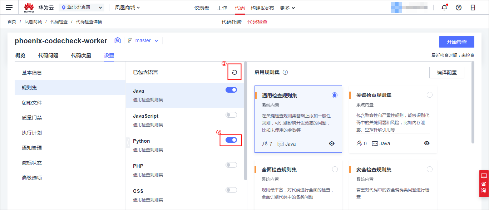
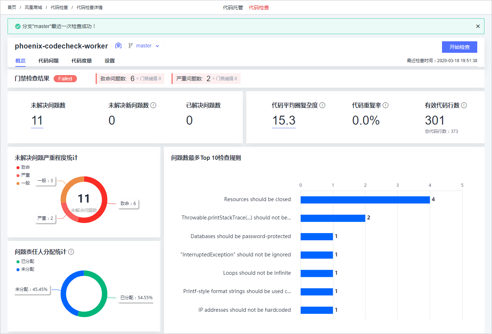
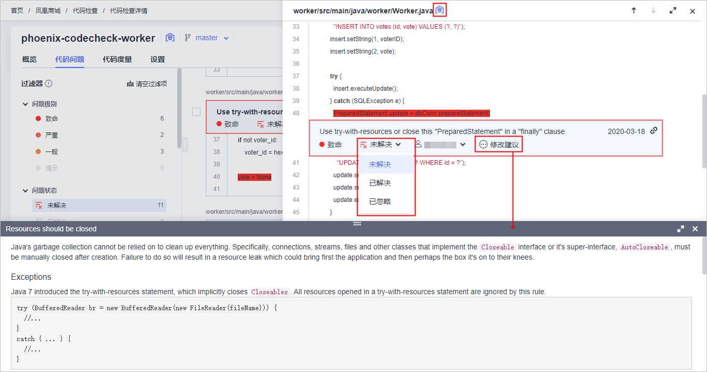
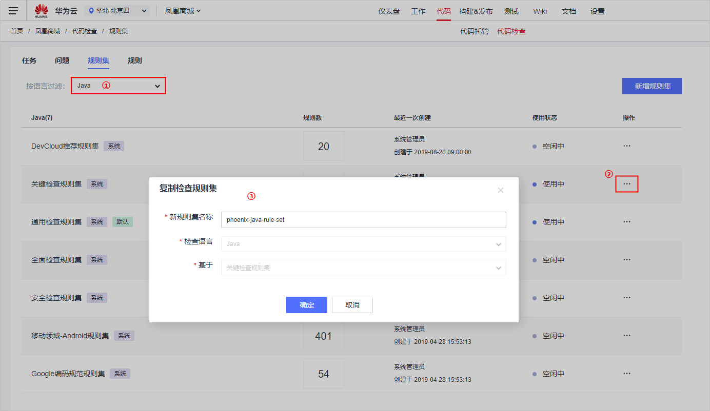
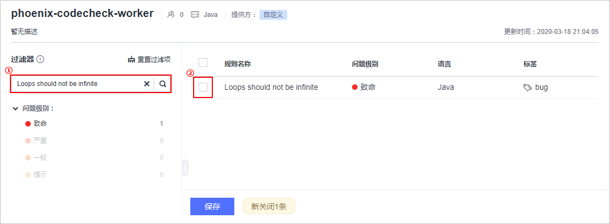
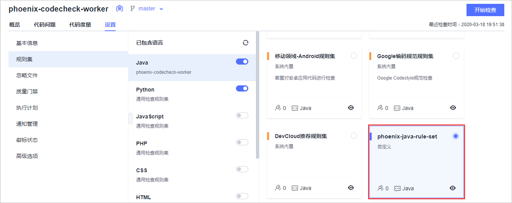
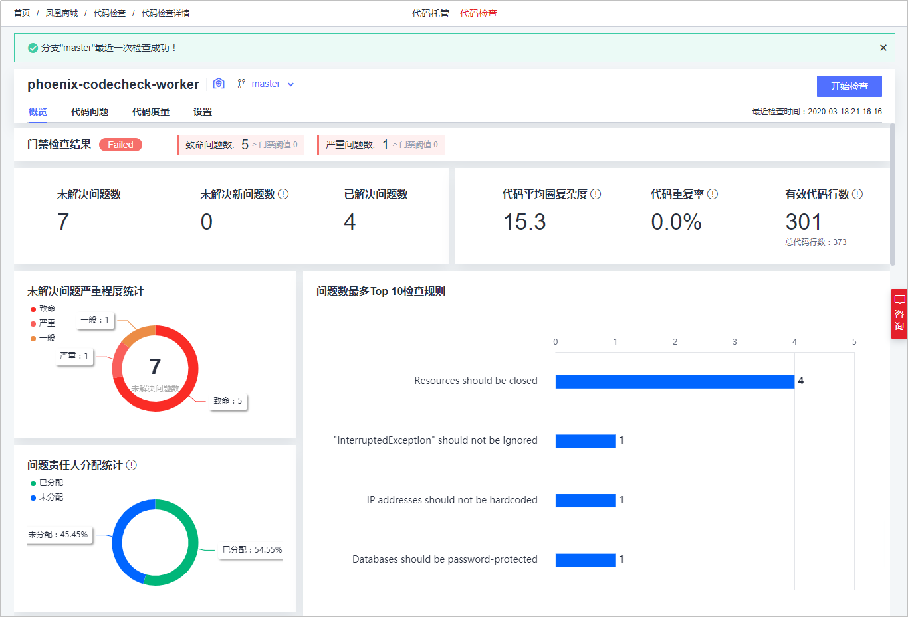

# **使用静态代码检查确保编码规范的有效落地**<a name="devcloud_practice_2005"></a>

通过本章节，您将了解如何使用DevCloud提供的**代码检查**服务完成针对不同技术栈的代码静态扫描，问题收集与修复。

## **背景**<a name="section49011679"></a>

```
项目经理：随着凤凰商城越来越庞大，线上出现的缺陷以及安全问题也越来越多，修复的成本太大了，其实很多问题是可以在上线之前就应该发现以及修复的。而且开发人员写代码也比较随性，没有统一标准，我们需要制定一些基本的标准，并对代码进行持续的静态代码扫描，一旦发现问题立即在迭代内修复。这样才能保证我们上线的应用相对可靠。
```

样例项目中预置了以下4个代码检查任务，本章节以任务“phoenix-codecheck-worker“为例进行讲解。

<a name="table11691548568"></a>
<table><thead align="left"><tr id="row51691481065"><th class="cellrowborder" valign="top" width="25%" id="mcps1.1.3.1.1"><p id="p31694485618"><a name="p31694485618"></a><a name="p31694485618"></a><strong id="b734511581767"><a name="b734511581767"></a><a name="b734511581767"></a>预置代码检查任务</strong></p>
</th>
<th class="cellrowborder" valign="top" width="75%" id="mcps1.1.3.1.2"><p id="p7169194811614"><a name="p7169194811614"></a><a name="p7169194811614"></a><strong id="b15129419718"><a name="b15129419718"></a><a name="b15129419718"></a>任务说明</strong></p>
</th>
</tr>
</thead>
<tbody><tr id="row10169164815619"><td class="cellrowborder" valign="top" width="25%" headers="mcps1.1.3.1.1 "><p id="p131708481462"><a name="p131708481462"></a><a name="p131708481462"></a>phoenix-codecheck-worker</p>
</td>
<td class="cellrowborder" valign="top" width="75%" headers="mcps1.1.3.1.2 "><p id="p717017481762"><a name="p717017481762"></a><a name="p717017481762"></a>worker功能对应的代码检查任务。</p>
</td>
</tr>
<tr id="row1217014480615"><td class="cellrowborder" valign="top" width="25%" headers="mcps1.1.3.1.1 "><p id="p517015481762"><a name="p517015481762"></a><a name="p517015481762"></a>phoenix-codecheck-result</p>
</td>
<td class="cellrowborder" valign="top" width="75%" headers="mcps1.1.3.1.2 "><p id="p111708481361"><a name="p111708481361"></a><a name="p111708481361"></a>result功能对应的代码检查任务。</p>
</td>
</tr>
<tr id="row31709481564"><td class="cellrowborder" valign="top" width="25%" headers="mcps1.1.3.1.1 "><p id="p117064813612"><a name="p117064813612"></a><a name="p117064813612"></a>phoenix-codecheck-vote</p>
</td>
<td class="cellrowborder" valign="top" width="75%" headers="mcps1.1.3.1.2 "><p id="p111704485610"><a name="p111704485610"></a><a name="p111704485610"></a>vote功能对应的代码检查任务。</p>
</td>
</tr>
<tr id="row1217016481369"><td class="cellrowborder" valign="top" width="25%" headers="mcps1.1.3.1.1 "><p id="p51706487612"><a name="p51706487612"></a><a name="p51706487612"></a>phoenix-codecheck-javas</p>
</td>
<td class="cellrowborder" valign="top" width="75%" headers="mcps1.1.3.1.2 "><p id="p7170114816618"><a name="p7170114816618"></a><a name="p7170114816618"></a>整个代码仓库对应的JavaScript代码检查任务。</p>
</td>
</tr>
</tbody>
</table>

> **说明：**   
>关于vote、result、worker的说明，请参见[HE2E DevOps实践流程](HE2E-DevOps实践流程.md)。  

## **为示例项目配置代码检查任务并执行**<a name="section38451933"></a>

通过本节，您将学习如何编辑并执行代码检查任务，完成应用的静态代码检查。

-   **编辑代码检查任务包含语言**
    1.  进入项目，单击页面上方导航“代码  \>  代码检查“，进入代码检查服务。

        单击代码检查任务“phoenix-codecheck-worker“，进入“代码检查详情“页面。

    2.  选择“设置“页签，在页面左侧导航中单击“规则集“。

        规则集中默认包含的语言是“Java“。单击图标重新获取代码仓库语言，在刷新的列表中将Python语言对应的开关打开。

        

          


-   **启动代码检查任务**
    1.  进入代码检查任务“phoenix-codecheck-worker“的“代码检查详情“页面。
    2.  单击“开始检查“，启动代码检查任务。

        当页面提示“分支"master"最近一次检查成功！“，表示任务执行成功。

        若系统报错，请参考[代码检查-常见问题-常见报错解决方法](https://support.huaweicloud.com/codecheck_faq/codecheck_02_0002.html)排查。


## **分析代码检查结果并修复问题**<a name="section10523083"></a>

通过本节，您将学习如何根据代码检查结果分析代码中存在的问题，并解决代码问题。

-   **分析代码检查报表**
    1.  进入代码检查任务“phoenix-codecheck-worker“的“代码检查详情“页面。
    2.  成功执行代码检查任务，查看检查结果。

        

          

        > **说明：**   
        >在代码检查任务“设置  \>  质量门禁“页面中，默认配置“致命问题数<=0“和“严重问题数<=0“，从上图可以看出，检查结果不符合门禁要求，因此门禁检查结果显示为“Failed“。  

          

    3.  单击“代码问题“页签，页面中列出问题的严重级别、状态、所属文件等信息。
    4.  可根据需要对代码进行修改。

        例如：下图中的问题，是在代码里Connection没有关闭可能会引起的资源泄漏问题，属于非常严重的问题，需要尽快修复。

        

          

        单击问题卡片，页面右侧将滑出窗口

        -   单击“修改建议“，可查看系统对此问题的修改建议
        -   单击窗口上方的图片，可进入相应的代码文件修改代码。
        -   单击“未解决“，可将此问题的状态设置为“已解决“或“已忽略“。

        

          


## **配置和管理代码检查规则集**<a name="section27598891"></a>

通过本节，您将学习如何新增以及管理规则集，定制自定义的代码检查规范。

-   **创建自定义检查规范**
    1.  进入代码检查服务，选择“规则集“页签，在下拉列表中选择“Java“。

        在过滤出的列表中找到规则集“关键检查规则集“，单击图标，在下拉列表中选择“复制“。

        在弹框中输入新规则集名称为“phoenix-java-rule-set“，单击“确定“保存。

        

          

    2.  系统自动进入新建规则集的“规则集配置“页面。

        通过搜索框搜索规则“Loops should not be infinite“，取消勾选此规则，单击“保存“。

        

          

        > **说明：**   
        >由于这里凤凰团队采用了取巧的方案临时支持功能是实时展示，暂时可以关闭此问题。  


-   **启用自定义检查规范**
    1.  进入代码检查任务“phoenix-codecheck-worker“的“代码检查详情“页面。
    2.  选择“设置“页签，在页面左侧导航中单击“规则集“。

        在Java语言规则集中，勾选规则集“phoenix-java-rule-set“。

        

          

    3.  启动代码检查任务，任务成功执行后，再次查看检查结果。

        此时的检查结果忽略了规则“Loops should not be infinite“，检查出来的问题是团队关心的问题，应该尽快修复掉。

        

          


