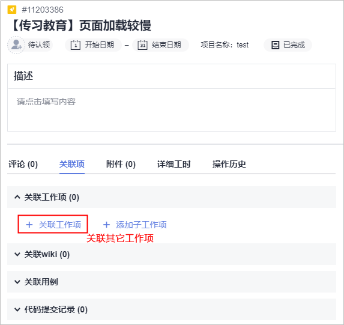
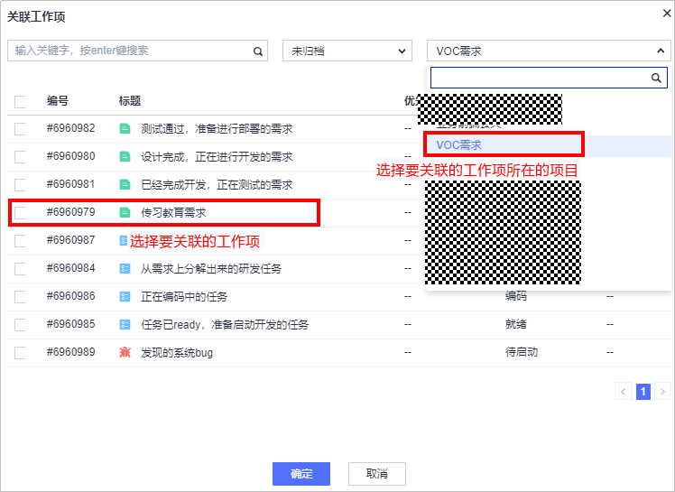

# **如何有效管理用户声音**

## **背景**

目前，很多互联网企业越发地注重用户声音。用户声音，也可以说是用户对产品甚至说对企业的期望和认可，对于企业的发展来说起到重要的作用。

用户声音往往具有量多、琐碎、突发性强等特点，所以很多企业会涉及到组建专门的客服团队，作为用户和产品研发团队的中间纽带，以适应市场提升产品竞争力。

本文主要是解决客服工作管理的问题，客服工作如何开展（例如如何解决客户问题让客户满意之类的问题）不在本文范围内。

## **问题分析**

众所周知，随着物联网时代的到来，数据正成指数倍增长。据IBM研究，90%的数据来源于最近2年，大数据时代已经到来。

在互联网初期阶段，某米公司，正是通过管理和接纳了几百上千的粉丝的声音取得了成功。而现在，人手一部手机，一部手机就可以用来代表一个客户的声音，而且渠道也不再是单一化的，用户声音已然成为一种大数据。

用户声音在大数据时代不仅仅是量多，而且是个体化的，正所谓“一万个读者就有一万个哈姆雷特”，用户声音的复杂程度早已不再是千奇百怪、五花八门能形容的了，此外还有突发性强等特点。能否对用户声音的数据进行有效管理将会成为在大数据时代生存和参与竞争的一项基本能力，这也是对企业提出了很大的挑战。

## **解决方案**

企业的管理者或项目经理，在规划管理日常用户声音大多采用的流程是，先收集用户的问题，然后整理提交需求，再由研发团队进行新需求的开发或者Bug的修复，最后反馈给用户，形成闭环。根据这个流程，可以从客服团队的工作管理、用户声音的分类管理、产品研发团队的协作三方面来解决客服工作管理的问题。

-   **客服团队的工作管理**

    企业的管理者或项目经理可以按照团队规模的大小，以及客服工作量的大小，决定是否安排专职人员做接待用户声音的工作。如果团队规模较大，客服工作量也大的话，需组建专门的客服团队来负责管理客户的声音。反之，可以让一个开发团队的成员兼职做客服工作，一般建议由团队最懂业务的人员。团队组建后，由于用户声音量多、琐碎、突发性强等特点，一般企业或团队会使用项目管理工具进行管理。华为云的DevCloud是基于敏捷思想设计的DevOps工具链（更多了解请见附件或官网），在做关于用户声音的项目管理时，以DevCloud为例。当客服团队有用户声音需要处理时，可以在DevCloud中创建一个看板项目，并为其创建对应的工作项（需求或Bug）。如下图：

    

      

    针对每一个用户声音，建议从工作项名称能看出来客户来源和主要问题。为了能更加方便的查询，建议为工作项设置相应的模块和标签，通过模块和标签等作为过滤条件快速筛选。然后跟踪工作项状态，直至用户声音得到解决，工作项关闭为止（更多看板项目的操作请见参考[项目管理用户指南-管理看板项目](https://support.huaweicloud.com/usermanual-projectman/devcloud_hlp_00021.html)）。

    

      

    此外，模块和标签的设置还可以在**所有工作项**的视图中实现分组的效果。

    

      

    更多具体配置操作还应按实际情况灵活使用。

-   **用户声音的分类管理**

    一般来说，用户声音根据其特点分为两大类，一类是对于产品的视觉、使用、习惯等方面的建议、投诉、表扬的非实时性的，另一类属于实时性的，即需要马上得到回答和解决。这样分类后可以便于管理，以减少人力提升效能。企业的管理者或项目经理可按情况分别处理，建议如下：

    -   **非实时性**

        对于非实时性，只需要单向收集客户的反馈就行。对于这种情况，可以通过增加一个渠道，让用户以文字的形式选择相关的分类进行反馈，这样对处理用户声音的工作实效性就没有太高要求。比如通过进入到[云声](https://bbs.huaweicloud.com/suggestion)的页面，然后提出反馈意见，如下图所示：

        

          

    -   **实时性**

        对于实时性的处理用户问题，需要提供实时的客服渠道，首先可以将常见问题及答案提供出来，这样能解决一些共性、常见的用户问题。对于个性化的问题，可以先通过智能机器人问答的形式来处理，即通过用户输入的关键字，智能机器人提供相关的回答，最后是通过提供人工客服的方式，回答用户问题。

-   **产品研发团队的协作**

    当客服团队收集到用户声音后，需要将需求或Bug等提交到研发团队，然后上线解决、再通知用户形成闭环。但是由于客服团队和研发团队在一个公司内常常是两个不同的组织，所从属的领导也不是同一个，所以为了避免协作过程中的责任划分不清、踢皮球的情况，建议企业的管理者要因此特性制定好协作的工作方式，让双方都能遵循。在DevCloud中可以通过Wiki来记录规则和说明，如下所示：

    

      

    当用户提出反馈意见或建议后，随着时间的推移，可能会需要主动或被动的给用户以反馈，那么就需要客服团队和研发团队能共享关于该用户声音需求的进展情况，形成双向关联。这样的好处不仅是能做到客服方能跟踪需求掌握进展，还能让研发团队了解到真实场景，更加符合用户的真实需求。在DevCloud中，可以通过工作项中的关联功能实现双向关联。如下图所示：

    

      

    当客服团队在所在项目中（VOC管理）创建完工作项（【传习教育】页面加载较慢）后可以通过**关联工作项**的功能和开发团队的项目（云声需求）中工作项（传习教育需求）做关联，见下图：

    

      

华为DevCloud提供了强大的项目管理和跨团队协作能力，更多功能操作请见参考[项目管理-帮助中心](https://support.huaweicloud.com/projectman/index.html)。

  

