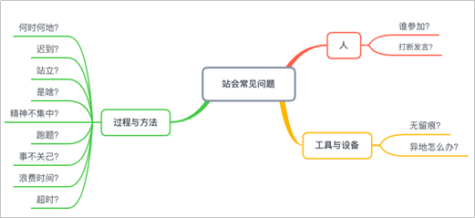
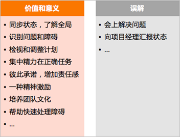
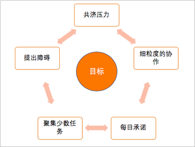
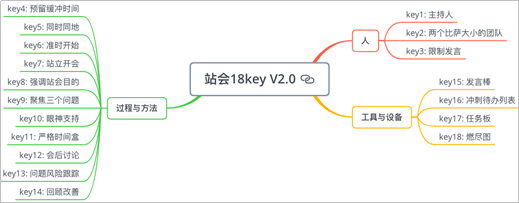
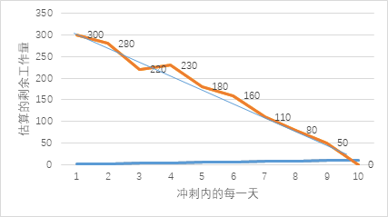

# **如何玩转每日站会**

## **背景**

企业的一些项目团队每天都开站会，像Scrum里面建议的一样说那三个问题，但是效果不理想，好像是形式化的内容，并没有起到什么实质的作用。比如，开完站会后，成员继续做着手头的工作，成员依然只关心自己的工作，其它人员的工作完全不了解，好像站会并没有带来什么效果。再比如，开站会本身也有很多问题：会议超时、成员迟到、成员注意力不集中等，具体常见问题如下图所示。

  

到底如何正确的开站会？站会的意义在哪里？可以不开站会吗？这些问题一直困惑着不少的团队。

## **问题分析**

关于站会的问题大致分为两中场景：

-   **场景一：**团队非常清楚应该开站会，认识到站会确实有一些价值，但是对于目前的站会状况不是很满意，如何玩转站会是团队关心的。对于这类的团队，问题的根源为不是非常清楚站会的核心价值，以及不知道怎么样实践，团队更需要一些具体的措施来帮助他们更好的开站立会议。
-   **场景二：**团队在试着开站立会议，不知道站立会议有什么价值，好像开和没开没有什么区别。针对这种情况，是因为团队没有尝到站会的价值带来的甜头，团队没有概念，同样缺乏最佳实践。

综上，不管是第一种还是第二种情况，都需要对站会的价值进一步理解，也就是为什么要开站会，它的意义是什么？然后，都需要明确正确的站会应该怎么样开?最后，都需要一些最佳实践和关键点来帮助团队开好站会。

## **解决措施**

为了增加一些趣味性，我们先来看两个视频，思考和感受一下“正确”与正确的站会可以开成什么样。

-   **视频一：[教您开“正确”站会](https://devcloud.rnd.huawei.com/docman/project/5d497e81bbe94eb7a047b46280245200/docman/detail/520270/list)**
-   **视频二：[教您开正确站会](https://devcloud.rnd.huawei.com/docman/project/5d497e81bbe94eb7a047b46280245200/docman/detail/520271/list)。**

如何玩转站会？我们按照如下思路学习一下。

1.  **理解站会价值**

    团队每天站着召开的短时间会议称之为每日站会。每日站会是团队对每天工作检视和调整，提前进行自组织。

    通过站会团队每个人可以了解全局，知道发生了什么事情，实现冲刺目标的进展如何，对当天的工作是否需要修改计划，有什么问题或者障碍需要处理。每日站会是一个检视、同步、适应性制定每日计划的活动，以帮助自组织团队更好地完成工作。

    有些团队认为每日站会是解决问题的，是传统意义上向项目经理汇报状态的会议，其实都是不准确的，或者说误解了它的核心意义和价值。

    每日站会对于让团队成员每天集中精力在正确的任务上是十分有效的。因为团队成员在同伴面前当众作出承诺，所以一般不会推脱责任。给团队成员一种精神激励，要对每日的工作目标信守承诺。每日站会还可以保证Scrum Master和团队成员可以快速处理障碍，培养团队文化，让每个人意识到我们是“整个团队在一同战斗”，一些没有使用敏捷的组织有时候也同样做采用每日站会。

    归纳一下站会的价值和意义，以及误解：

    

      

2.  **明确正确站会**

    正确的站会应该怎么开呢？我们一起学习下。

    对于每天的工作，为了提前进行自组织，团队成员准时围绕着白板前站立（增加仪式感）。

    

      

    团队成员在站会上需要轮流发言，回答如下三个问题：

    1.  ​ 我昨天做了什么？（从上次站会到现在，我做了什么？）
    2.  ​ 今天计划做什么？（在下次站会之前，我会做什么？）
    3.  ​ 我遇到了哪些问题和障碍？（哪些问题和障碍阻止了我的工作或使我的工作放缓？）

    这简单的三个问题可以促使团队成员每天都要检视自己的工作、制定自己的工作计划、获得清除障碍的帮助以及对团队做出承诺。如果团队按正确的方式开站会，进行得好的话，可以达到如下效果：

    

      

    -   **共济压力**

        健康的敏捷团队都会共济压力。所有的团队成员都要承诺要一起完成冲刺的工作。这就使得团队成员之前相互依赖并且对彼此负责。如果一个团队成员连续几天都做相同的事情，并且没有进展，显然缺乏前进的动力，而其它团队成员不能视而不见。因为他未完成的工作会变成其他成员的障碍。

    -   **细粒度的协作**

        在站立会中，团队成员的交流应该快速而且有重点。举例，当一个成员说完今天计划做什么后，另外一个成员可以会说：“哦，原来你今天计划做这个啊，这就意味着我要调整我的工作优先级，没关系，你按照你的计划做吧，我可以调整。很高兴你说了这些。”这种细粒度的协作使得团队成员知道他们之间如何及何时仰仗对方。一个敏捷团队应该追求高效、零等待，避免等待浪费。

    -   **聚集少数任务**

        在站会期间，团队中的每位成员都可以知道哪些工作正在进行，哪些工作已经完成。健康的团队应该关注事情的完成，也就是说任务不能一直处在进行中。在站会中，团队需要确认哪几个少数任务是当前的焦点，这样团队就可以尽快把焦点任务做完。换句话说，做完10件事，远比正在做100件事儿更有意义。

    -   **每日承诺**

        在站会上，团队成员需要对团队做出承诺。这样团队成员就知道敏捷交付什么成果并如何保持彼此负责。

    -   **提出障碍**

        其实在敏捷中任何时间都可以提出障碍，但是站会是一个黄金时刻，团队成员可以停下来认真思考“有什么事情阻碍了我或让我的工作放缓了”

3.  **最佳实践和关键点**

    前面理解和明确了站会的价值和站会怎么开，以及开得好会获得什么样的效果，但是没有讲怎么可以把站会开好，实践的关键点是什么并没有讲。别急，接下来一起来总结下站会开好的关键点。通过大量实践总结出一些能够帮助开好站会的关键点，也许这些关键点并不是全适用，所以还是要根据现实情况做出合适自己团队的选择和裁剪。这些关键点，我们称之为“站会18 key”。

    站会18key按照人（People）、过程与方法\(Procedures and methods\)、工具与设备\(Tools and equipment\)划分，帮助大家记忆和学习。

    

      

    -   **Key 1: 主持人**

        会议主持人（比如Scrum Master，也可以团队成员轮班，轮流感受下站会的节奏）确保会议的举行，并控制会议时间，团队成员进行简短有效的沟通。

    -   **Key 2: 两个比萨大小的团队**

        在《Scrum敏捷软件开发》一书中，作者麦克.科思提出了一个简单的方法用来辨别什么是合适的团队规模，那就是，如果两个比萨够整个团队成员吃的话，那么这个团队的规模比较适合。

        因为两个比萨大小的团队跟家庭的规模相似，站立会的目标可以轻松达成。当团队是家庭规模大小时，人们头脑中就很容易追踪到团队中发生的事情。人们可以很容易地记住每个人每天的承诺，以及每个人对于其他成员或团队成果的责任。Scrum中也建议团队规模不要太大，一般为7-9人左右。

        最后再强调一点，并不是要求团队一定要按以上15key进行开站会，15key只是在很多实践中总结出来的一些经验，曾经解决过很多问题。对于每个具体团队需要结合实际情况进行选择应用15key,没有绝对的对与错，只有适合和不适合。

    -   **Key 3: 限制发言**

        团队外成员也可以参与，但没有发言权。Scrum中曾经使用过术语“猪”和“鸡”来区别在每日站会中哪些人应该参与发言，哪些人就站在旁边看就行了，不过这两个术语现在已经不用了。这两个农场动物术语来自一个老笑话：“在早餐吃的火腿鸡蛋中，鸡是参与者，猪是全部投入了。”显然，Scrum使用这些术语是为了区分参与者（鸡）和为了实现冲刺目标面全力投入的人（猪）。在每日站会中，只有猪应该发言，如果有鸡参加例会的话，应该作为旁观者。

    -   **Key 4: 预留缓冲时间**

        建议开发团队在上班时间后的半小时或者1小时后开每日站会。这样可以给堵车、喝咖啡、查看邮件、去卫生间或其他每天上班后的例行工作提供一些缓冲时间。晚点开会还可以给开发团队一点时间来检查前一天的工作（比如，前一天晚上开始运行的自动化测试工具所生成的缺陷报告）。

    -   **Key 5: 同时同地**

        每日站立会议应尽可能在同一时间、同一地点召开，最好的方式是在团队的可视化的任务板前面召开。同一时间和地点也可以有效帮助团队成员形成固有的节奏，不用在找地点和确认当天的开会时间浪费时间。

    -   **Key 6: 准时开始**

        所有的团队成员需自觉按时到场，会议主持人要按照预定的时间按时开始会议，而不管是否有人还没到。对于迟到的人员要有一些惩罚措施，比如缴纳罚金或做俯卧撑等。惩罚措施和数量由团队成员事先共同商定，如果是罚金，如何支配也由团队共同决定。如果团队成员就是不自觉按时到场怎么办？关于更多这方面的解决方案请参见下面的了解更多中的“成员迟到的解决方案”。

    -   **Key 7: 站立开会**

        团队成员一定要站着开会，这也是会议的名字叫站立会议的原因。站着开会确实比坐着开会简明扼要，让人更想快一点结束会议，开始一天的工作。坐下容易使人放松，精神不集中，不易控制时间（相信很多人有体会）。

    -   **Key 8: 强调站会目的**

        经常强调站会目的，特别适合刚刚启用站会的团队。可以由Scrum Master来强调，如果没有Scrum Master也可以由其它Leader（轮职的主持人也可以）来强调。然后询问团队成员“站会对你们来说怎么样？你们得到了什么成果？”几次以后，团队成员可能选择目标声明作为每天的度量，在每次站会之后，团队成员对自己的表现做出相应的评价，是一种强有力的自我管理工具。

    -   **Key 9: 聚焦三个问题**

        站会期间，团队成员就说那典型的三个问题（昨天…今天…障碍是…），其它事情不说。只讨论已完工和即将开始的工作，或者在这些工作中碰到的问题和障碍。目的不是向领导汇报工作，而是团队成员之间相互交流，以共同了解项目情况和共同解决问题。

    -   **Key 10: 眼神支持**

        这是一个好玩的游戏：当一个人站在前面发言时，要求其他团队成员都直视发言人，并进行眼神交流。别让发言人抓到你在看别处。这个游戏帮助发言人的发言简洁，同时可以加强成员对发言人所讲内容的理解。这样可以帮助团队加速完善每日计划。

    -   **Key 11：严格时间盒**

        站会是开发团队的一个时间盒限定为 15 分钟的事件。 时间建议不要太久，对于5-9人的团队来讲15分钟的会议时间足够。

    -   **Key 12: 会后讨论**

        某位团队成员在发言期间，其他人员应认真倾听，如有疑问可简短确认，但不应做过多讨论。如果对某位成员的报告内容感兴趣或需要其他成员的帮助，任何人都可以在每日站立会议结束后即刻召集相关感兴趣的人员进行进一步的讨论。

    -   **Key 13: 问题风险跟踪**

        将站会成员遇到的问题和风险做概要的记录（不必详细，只要说明重点即可，不需要在记录上花费更多的时间），然后保留到wiki，或者方便大家跟踪的地方。此目的是确保这些问题和风险得到了闭环（例如，问题和风险可以会后按排专题讨论、跟踪，直到关闭）。

    -   **Key 14: 回顾改善**

        本身每日站会就是最小化的戴明环（PDCA），另外团队在回顾会议上时也可以对站会开的效果进行回顾，哪些地方做得好，哪些地方做得不好，有哪些改善点可以在下一轮迭代中改善等。（站会只是回顾会议中一个回顾点，如果没有问题不用做专题回顾）

    -   **Key 15: 发言棒**

        站会时可以利用一些小道具来保证会议不会超时。我会找一只笔或者一个娃娃（女生多的团队）作为发言棒仍给一位成员，让他拿着发言棒陈述完“三个问题”，然后将其交给下一位。没有拿发言棒的成员不允许发言。如果有人用时过长，我会把发言棒换成一个水桶（当然是盛满水的）让他托起，直到托不动为止。如果他想说就让他说，要么会议很快结束，要么我们的开发人员练成强大的臂力，按我经验，一般都会挑重点说，会议按时结束。

    -   **Key 16: 冲刺待办列表**

        站会中，成员在发言时可以利用冲刺待办列表来检视当前工作项的完成状态。冲刺待办列表记录了团队成员工作的进展，需要每天更新并跟踪。电子化的冲刺待办列表更能很好的解决异地团队开站会思路不聚集的问题。发言人在讲那“三个问题”时，同步可以展示冲刺待办列表给团队。DevCloud冲刺代办列表演示如下。

        

          

    -   **Key17: 任务看板**

        在站会期间，通过任务板，团队中每一个人都可以知道哪些工作正在进行，哪些工作已经完成。团队关注事情的完成，一直处于进行中的任务为被发现，成为当前的焦点，这样团队就可以尽快把这些焦点问题解决掉。

        **Key 18: 燃尽图**

        燃尽图是将进展和剩余工作情况可视化的有力工具。一般竖轴表示剩余工作量（小时、故事点或工作项个数），横轴表示冲刺时间（一般单位为天）。

        

          

        开站会时，发言人可以利用燃尽图来做进展讲解。燃尽图让所有团队成员一眼就可以看出冲刺的状态，进展情况非常清楚，看出工作是否在按计划进行，状态是否良好。这些信息可以帮助团队确定是否可以完成预定数量的工作项，并在冲刺早期做出明知的决定。使用燃图易达成如下效果：

        1.  ​高可视性，直观展示进度情况和剩余工作；
        2.  ​快速识别风险；
        3.  ​帮助团队建立信心，了解自己的能力；
        4.  了解团队成员工作步调；
        5.  ​了解团队冲刺计划；
        6.  ​和任务墙能非常高效地匹配使用。

    关于18key，这里想强调一下，并不是站立会议时要把所有18key都要执行一遍，这里的18key只是提供了一些参考实践和关键点，18key来源于大量的实践，也解决过团队站会的问题，所以大家在站会遇到了问题时，可以先想到这个18key，然后选择适合自己团队的key。没有绝对的对与错，只有适合和不适合。举一个例子，这里有四个key是关于工具的，这些工具我们都要使用吗？当然不一定。敏捷宣言里提到“个体和互动高于流程和工具”，工具是为团队服务的，不是团队的负担，更不能被工具所绑架。所以团队一起选择适合的，才是正确的做法。

## **了解更多**：**成员迟到的解决方案**

对于经常有人迟到的现象，团队成员在回顾会议上可以认真分析原因，重新征求团队成员意见，为什么每日站会的开始时间一定是早晨九点，其它时间是否可以，是否有什么困难，团队成员共同找出问题原因并做出决定。

促进团队成员需要自觉按时到场的意识，尊重别人的意识。会议主持人要按照预先定的时间、地点开始会议，而不管是否还有人没到场。有人迟到不要重复信息，否则会传达“可以迟到”的信号。

对于迟到的人员要有一些惩罚措施，比如红包、做俯卧撑、全体下午茶等。惩罚措施和数量由团队成员事先共同商定。如果是红包，如何支配由团队共同决定。不要PM或SM自己决定让团队执行。相比别人给你的规则，大家更愿意执行自己提出的规则，守自己的承诺。

如果说发红包和下午茶这样的惩罚对于那些土豪无约束，那就把惩罚做到可视化。比如在白板中规划出一个特定区域，每迟到一次就把照片贴上去，次数累加。这个特定迟到的区域是迟到信息的扩大器，让更多的人看到。俗话说，人要脸树要皮，相信会有所收敛（此方法要考虑多一些，避免意外）。

对于经常迟到的人需要谈话，试着理解他有哪些问题，是否有真正的困难，关心团队成员，大家一起帮助解决困难。

如果迟到现象严重，可能不是团队能解决的问题了，可以试着从公司政策方面施压，严格执行公司的考勤制度，但其实不符合敏捷的自管理相思，不是真正解决问题的方法。

总结一下解决迟到现象应该关注以下因素：

-   ​ 分析原因，关心成员，共同决定
-   ​ 同一时间，同一地点，准时开会
-   ​ 有人迟到，不重复同步信息
-   ​ 建议小惩罚机制
-   ​ 理解迟到原因，是否有困难

  

_**参考文献**_

-   _Kenneth S. Rubin. Scrum精髓\[M\].北京：清华大学出版社。_
-   _Lyssa Adkins. 如何构建敏捷项目管理团队\[M\].北京：电子工业出版社。_
-   _Mark C. Layton. 敏捷项目管理\[M\].北京：人民邮电出版社。_

  

