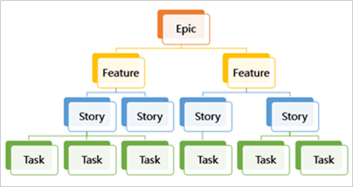
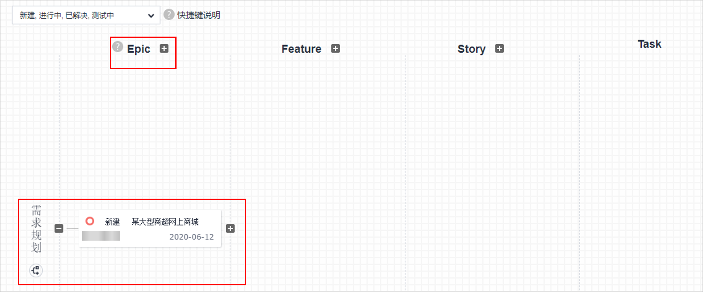
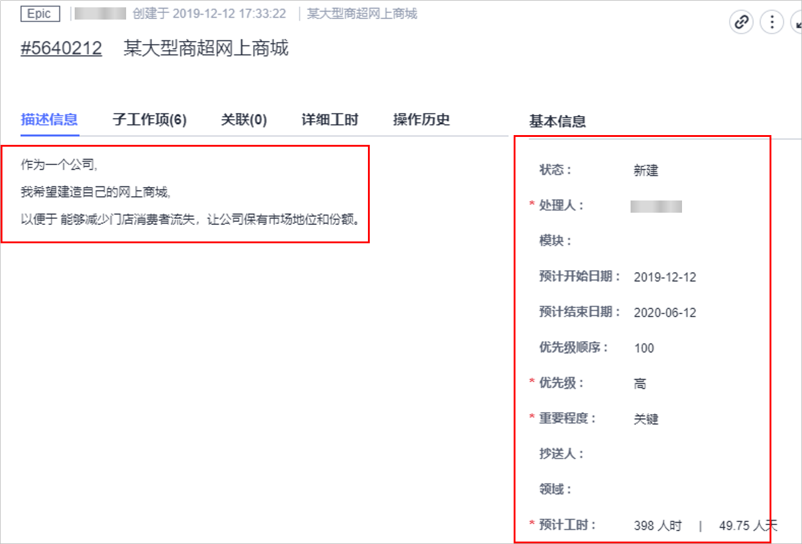
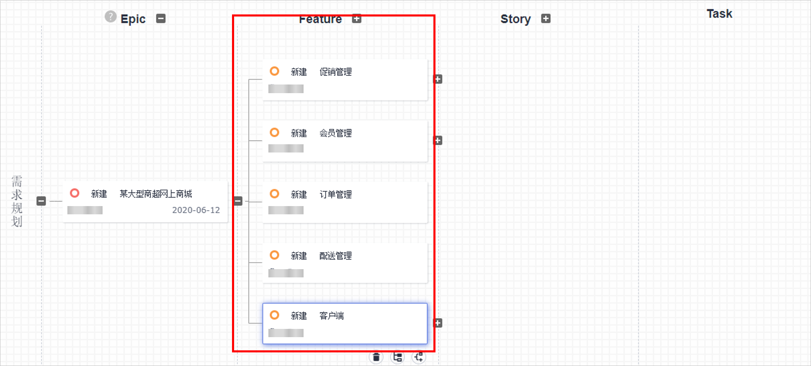
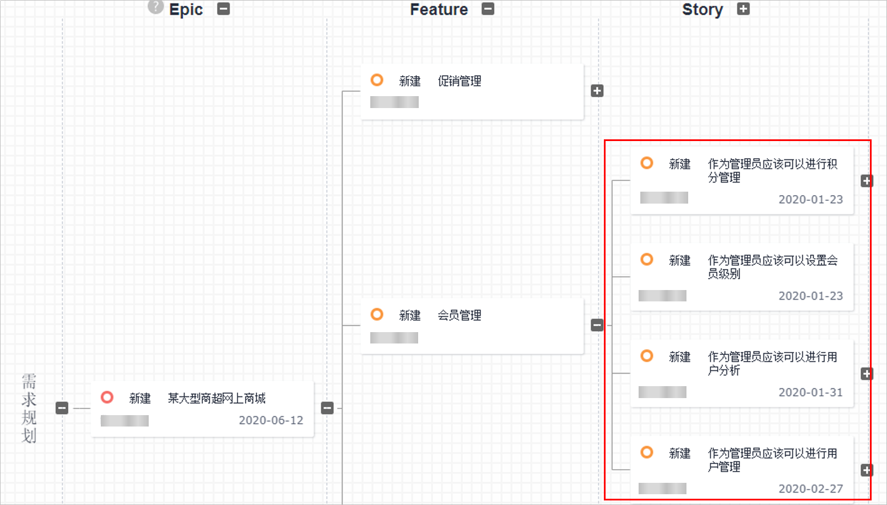

# **读懂敏捷需求管理的四个关键词**<a name="devcloud_practice_3012"></a>

## **引言**<a name="section19131440183219"></a>

我们常见到Epic、Feature、Story和Task这些和敏捷相关的概念，它们之间的关系是什么？我们如何灵活使用这些概念，从而让敏捷的需求管理更为高效？本文为您详细剖析这四个关键词。

## **什么是Epic、Feature、Story和Task？**<a name="section20557115013210"></a>

**Epic、Feature、Story和Task用来划分需求颗粒度的标签，**可以看作需求占位符，分别代表需求颗粒度从大到小。每个层级的需求本身又承载着一些意义，在进行需求划分的时候可以进行参考。

-   **Epic**：史诗，是项目的愿景目标。通过Epic的落地达成，使公司可以获得相应的市场地位和回报，具有战略价值。通常需要数月完成。
-   **Feature**：可以带来价值的产品功能和特性。相比Epic，Feature更具体，更形象，客户可以感知，具有业务价值。通常需要数周，多个Sprint才能够完成。
-   **Story：**通常所说的用户故事，是User Story的简称。Story是从用户角度对产品功能的详细描述，承接Feature，并放入产品Backlog中，持续规划，滚动调整，始终让高优先级Story交付给客户，具有用户价值。Story要符合INVEST原则（**I**dependent、**N**egotiable、**V**aluable、**E**stimable、**S**mall、**T**estable），通常需要数天，并在一个Sprint中完成。
-   **Task**：是团队成员要完成的具体任务。在Sprint计划会议上，将Story分配给成员，然后由成员分解为Task，并预估工时，通常在一天内完成。

## **Epic、Feature、Story和Task之间关系是什么？**<a name="section44373453320"></a>

**Epic-Feature-Story-Task是一种将需求进行结构化管理的方法**，在使用时是从上到下逐层分解，形成自下而上的依赖。如下图所示。



在实际的开发过程中，需求会发生变化，我们要不断的调整，在调整中避免偏离目标方向，每次新建需求的时候都要记得向上对齐到Epic，保证所添加的Story和Task和它们的上层是有关联的，这样就可以在一定程度上保证团队在朝着目标前进。

更多关于需求结构化管理的内容，请参考[如何进行需求结构化管理](如何进行需求结构化管理.md)。

## **我们如何灵活使用这些概念，让需求管理更为高效？**<a name="section1269111603310"></a>

为了加深对Epic、Feature、Story和Task的理解，本文对一个案例进行需求拆分，过程中会结合DevCloud项目管理服务进行展示。

```
案例：
某大型商超受互联网的冲击，营业额大幅下滑。
为了减少门店消费者流失，保有市场地位和份额，决定用6个月的时间建立自己的网上商城。
```

-   **第一步：Epic确定和创建**

    根据前面的介绍，在进行需求确认的时候先看颗粒度，然后再考虑其承载意义。

    此处需要考虑一个问题：**一个产品是一个Epic吗？产品的每个业务模块是Epic还是Feature？**

    -   产品通常具有战略意义，从这个角度看，产品适合作为一个Epic。但是不是所有的产品都适合，还要看产品是什么，它的颗粒度有多大。在本文的实例中，网上商城周期是6个月，目的是保有市场份额，从颗粒度和战略意义上，网上商城适合作为一个Epic。
    -   每个业务模块具体是Epic还是Feature要分情况。比如：构建智慧城市是一个愿景目标，下面包括智慧交通，智慧政务，智慧社区等，这些每个业务模块都很大，用Epic进行需求占位合适一些。

    我们在DevCoud创建一个Scrum项目，命名为“某大型商超网上商城”。进入“需求规划”界面，新建Epic，如下图所示。

    

      

    新建之后，点击进入到详细编辑界面。将描述信息填写完整，可以使用DevCloud提供的模板：

    -   **作为**：对于这个Epic来说，用户角色是整个公司。
    -   **我想要**：想要的结果就是建造网上商城。
    -   **以便于**：目的是想要减少消费者流失，保有市场地位和份额。

    同时在基本信息中设定这个Epic的起止时间，优先级，重要程度，预计工时等信息。这些信息对于团队理解产品、理解项目起到至关重要的作用，所以要进行详细填写。

    

      

-   **第二步：将Epic分解为Feature**

    客户要求在6个月内交付5个功能模块：促销管理、会员管理、订单管理、配送管理和客户端。团队的一个Sprint是2个星期，每个模块大概需要2-3个Sprint完成，从颗粒度和承载的意义，这5个模块适合作为Feature。

    

      

    创建之后，如需要填写详细信息，可以在详细页面进行编辑。界面信息项和前面Epic的相同，此处不再赘述。

-   **第三步：Feature分解为Story**

    敏捷开发是渐进明细的，不要求所有需求在相同时间做到同样详细，只要求当前Sprint和未来的一个或两个Sprint的Story是详细的。将来Sprint的Story可以是一个大概的情况。进入到当前Sprint的Story要符合INVEST原则。开发团队要在Sprint结束时完成交付。

    客户优先级中，会员管理Feature优先级高，会员管理这个Feature就要在需求梳理会议上详细分解为Story放入到产品Backlog中。经过分解后，需要包含和管理员相关的以下功能: 积分管理、会员级别管理、用户分析、用户管理。这些具体的功能就可以作为Story。需要注意的是，我们分解出的Story要尽量在一个迭代内完成交付，如果无法完成就尝试继续分解。因为只有交付的Story才是有价值的，无法交付的Story对于当前Sprint来说就是浪费。分解后的Story如下图所示。

    

      

-   **第四步：将Story划分为Task**

    在Sprint计划会议上，团队和PO要共同从产品Backlog中按照优先级顺序选择本次Sprint需要完成的Story，进入到冲刺Backlog中。团队成员认领后，将Story分解为Task，并进行估算。

    此时面临一个问题**：Story和Task如何区分？**

    -   **Story**聚焦价值，需要在Sprint中完成，要用数天的时间，要符合INVEST原则。Story的描述是一个名词，如积分管理这个Story的完整描述是：作为管理员，我能够进行会员的积分管理，以此来划分消费等级提供不同增值服务。
    -   **Task**聚焦实现价值，通过过程性的任务来实现Story的功能。通常是1-8个小时。Task的描述是一个动作。如积分管理这个Story，功能的实现需要通过业务逻辑开发，积分规则设计和积分数据库设计这几个过程来完成。这些就是Task。如下所示。

        

          

    这样，从Epic开始，到Task结束，我们完成了网上商城的需求拆分。


## **小结**<a name="section1118074811548"></a>

**使用Epic、Feature、Story、Task管理需求时，需要注意以下几个方面**。

1.  敏捷开发中需求是逐步细化的，遵循自上而下的方式去分解需求。
2.  Epic和Feature都是颗粒度比较大的需求，是用户对于产品的期望和功能特性的描述。
3.  分解为Story的时候，目前正在进行的Sprint需要分的更小更细，将来的Sprint需求（可能是3个及以上）就不需要那样细分。当进行到某个Sprint时，再进行分解，细分成一组更小、更细的条目。
4.  Task是对当前Sprint的Story进行的分解。
5.  所有这些粗略和详细的Story都放在产品Backlog中，整个列表要遵循DEEP（Detailed appropriately、Emergent、Estimated、Prioritized）原则，定期梳理和排序优化，保证高优先级的需求优先实现和交付。
6.  在整个过程中需要和客户一直保持沟通合作，这样才能保证我们实现的功能是客户真正想要的。

本文通过一个用户场景来帮助大家理解Epic、Feature、Story、Task的含义以及如何使用。在现实业务中，没有相同的项目。因此在开发过程中还要结合产品和业务本身的特点，进行具体问题具体分析。

  

_参考文献_

-   _《Scrum精髓》，Kenneth S. Rubin_
-   _《用户故事与敏捷方法》，Mike Cohn_

  

