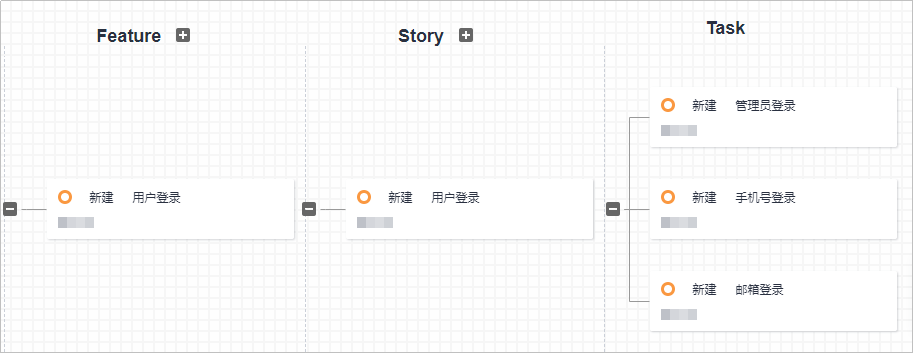

# **软件项目需求变更频繁，如何做好有效的需求管理和规划**

## **概述**

围绕项目需求变更频繁，如何做好有效的需求管理和规划，本文将从背景、问题分析、解决措施几个方面进行细致讲解。

## **背景**

不管是项目型软件开发还是产品型软件开发，需求变更频繁都是影响研发效能的第一号因素，在2019年中国DevOps现状调查报告中也可以发现，超半数企业认为需求的频繁变更是阻碍软件按时交付的主要原因。解决或缓解需求变更频繁带来的影响，是势在必行的重要工作。（详细解读请参见。）

## **问题分析**

由于每家企业的情况不同，包括客户合作方式、人员能力水平、研发流程等各方面的差异，同样是需求变更频繁，所体现出来的具体症状却有所不同，导致问题发生的根因也可能不同，所应采取的措施也需要根据实际情况来选择。根据我们的观察以及与企业交流的经验发现，一般都体现为如下几种场景：

-   需求杂乱、经常变更，难以管理。
-   领导或客户时不时地要把某些需求提前，打乱了开发计划。
-   做着做着发现有些需求遗漏了。

接下来我们结合这些情况的部分实例来分析：

-   **场景一：软件项目前期结构清楚，开发到后期，需求变化多而细，如何管理，如何规划。**

    此场景中，困扰我们的是前期需求不明确、不完善，导致后期需改动，需求发生变更。

    我们发现，出现这种情况，往往跟客户未能正确使用需求规划有一定关系，比如需求层次划分不清晰、缺少规范机制等问题。例如，某客户规划一个用户登录功能，按照下图所示规划需求。用户会将其中管理员登录的Task放在第一个版本中发布，后期又增加了一个手机号登录的需求，设置成Task放在第二个版本中发布，这样一个Story里面存在多个不同版本（或迭代）发布的Task，不方便管理。由此我们可以将这个问题的根因定性为**如何进行需求结构化管理**的问题：

    1.  没有区分跟随项目进展而持续产生的碎片化需求和系统/产品持续完善的功能特性。
    2.  对DevCloud提供的Epic-Feature-Story的需求结构理解有误，未能正确使用。

        

          

-   **场景二：软件项目进行过程中，领导需要提拉需求，在敏捷研发模式中该如何去操作？**

    提拉需求的意思也就是要将某些需求的优先级提高，要求团队先实现它们，因而我们将此问题定性为**需求优先级管理**的问题。解决此问题，我们需要了解：

    -   为什么领导会要提拉需求？如果是合理的，那么我们就应该提升响应能力、优化工作安排流程，使得优先级调整对研发进展带来的影响最小化，且我们能够尽快地响应领导需要，先交付被提拉的需求。
    -   这种情况发生频率有多高？如果是经常发生，那就是一种常态，而且是一种不好的常态，那我们需要去思考是什么导致了这种常态发生，并考虑如何从流程、制度、协作模式或人员能力等方面去做调整，减少过程中提拉需求情况的发生；如果是偶尔发生，那就可以特事特办，为例外情况调整流程、制度反而会加重常态工作的负担，没有必要。
    -   需要提拉的需求有无共性特点？比如是否都跟某个客户有关，或者跟某个功能域（如退款）有关？如果能够找到共性，那我们就可以针对这些共性去思考针对性的解决方案。

-   **场景三：由于外界原因经常会临时增加一些紧急需求，并且这是目前常态**

    临时增加需求，首先是一个如何处理突发需求的问题；紧急需求，也就是说需要马上就做，而且是插队，那就不仅仅是紧急，肯定也是重要的需求，不然不需要插队先做，所以这还涉及到需求优先级管理的问题。

    当两种情况合在一起，我们需要将它定性为是**重要需求遗漏**的问题，反问一句就是——为什么这些紧急重要的需求无法更早预见？同样的，我们需要了解：

    -   具体是哪些外界原因？这些原因是否有共性，有的话，那就针对性处理。
    -   增加的需求有无共性特点？有的话，可以针对性处理。
    -   临时增加有多临时？我们是否有提高或改善响应能力的空间，如果我们可以更快调整和响应，使得这些临时需求对我们产生不了什么影响，那么这个问题也就不再是问题了。
    -   既然是常态，为何我们的流程没有做出调整去应对？是调整过流程或工作方式，还是无法解决问题，还是说不知道该怎么调整流程或工作方式去适应？

## **解决措施**

综合前面几种参考情况经分析后得出了根因，基于这些根因，我们将所要解决的问题重新描述如下：

1.  如何进行需求结构化管理？
2.  如何进行需求优先级管理？
3.  如何避免重要需求遗漏？

详细说明如下：

-   **如何进行需求结构化管理？**

    首先，并不是说任何情况下都需要进行需求的结构化管理。只有在需求较多、且需求之间存在关联，而且即便是已经实现的需求也需要进行一定的管理、维护的情况下，我们才需要去思考需求结构化管理的问题，此时，我们需要使用DevCloud提供的Scrum项目模板，因为里面有Epic-Feature-Story的需求结构，以及需求规划功能可以辅助我们进行需求的结构化管理。那么我们应该以什么为脉络来建立这个结构呢？这就意味着，**我们的需求结构化管理，需要以产品或系统的功能特性的脉络为依据**。而软件项目管理所需要关注的版本、客户、模块等信息，则可以通过需求的不同属性甚至标签等方式来实现。

    简单来说，可以通过如下三个步骤来完成：

    1.  针对产品或系统建立DevCloud项目。
    2.  确立Epic-Feature-Story的需求结构。
    3.  对不同模块以及版本的管理，可以通过工作项的属性来进行管理。

    更多详情请参考[如何进行需求结构化管理](如何进行需求结构化管理.md)。

-   **如何进行需求优先级管理？**

    需求优先级的管理，其实是为了帮助我们确定先做哪个需求后做哪个需求，从而可以最大化我们的回报、最小化我们的风险或投入。要做好优先级管理，或者更直接来说是优先级顺序管理，我们需要做到如下几件事情：

    1.  确定优先级模型：需要考虑的因素以及因素的综合判断原则，比如[Kano模型](https://en.wikipedia.org/wiki/Kano_model)。
    2.  排定需求优先级顺序：因素的具体量化和排序标准，例如成本收益法是按照收入还是按利润的多少来排序。
    3.  调整需求优先级顺序。
    4.  改进优先级模型：根据反馈调整模型或模型的落地实施细节，以提升效果。

    更多详情请参考[如何进行需求优先级管理](如何进行需求优先级管理.md)。

-   **如何避免重要需求遗漏？**

    根据重要需求遗漏的事前、事中、事后的不同时间点，我们可以采取不同的措施。参照八二原则，我们需要确保常态问题有对应的处理方式，软件项目成员按照既定方案进行处理即可，而特殊情况要有应急机制指导现场处理、事后再复盘总结。

    1.  事中的处理：按照常规做法进行处理，或是特殊情况特殊处理，先解决眼下的问题。
    2.  事后的处理：基于模型或思路进行复盘，并落实为新的常规做法或特殊情况处理方式。
    3.  事前的处理：明确如何区分常规情况或特殊情况，并制定相应的处理方式或应急机制。

    更多详情请参考[如何避免重要需求遗漏](如何避免重要需求遗漏.md)。

  

_**参考文献**_

-   _[2019年中国DevOps行业现状报告：中国信息通信研究院、华为云DevCloud、南京大学联合发布](https://bbs.huaweicloud.com/forum/thread-21414-1-1.html)_
-   _《用户故事实战》_，_Mike Cohn_
-   _《成为技术领导者》_，_杰拉尔德·温伯格_
-   _《复盘+：把经验转化为能力》_，_邱昭良_

  

