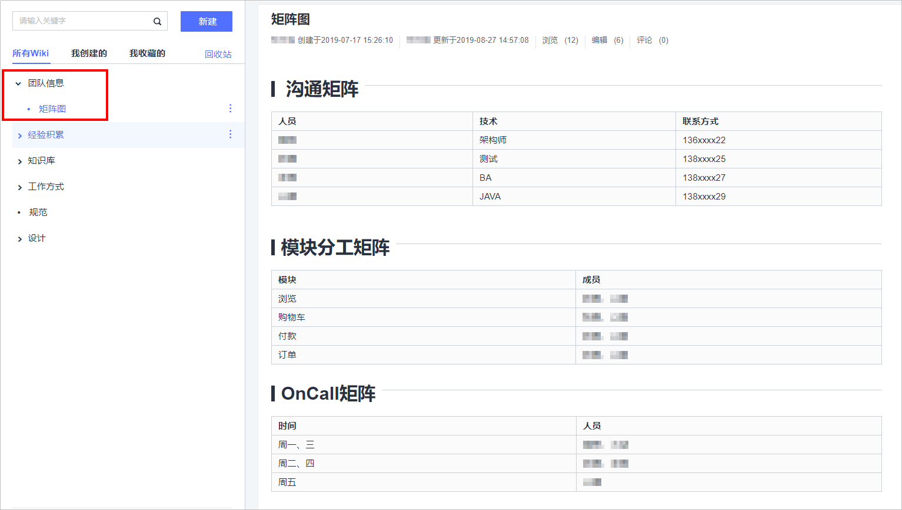
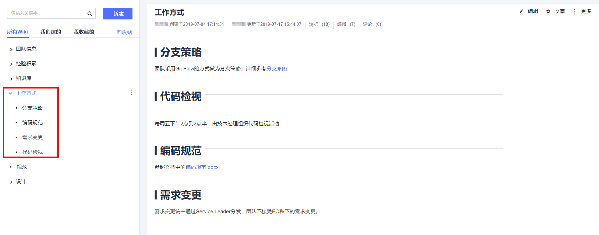
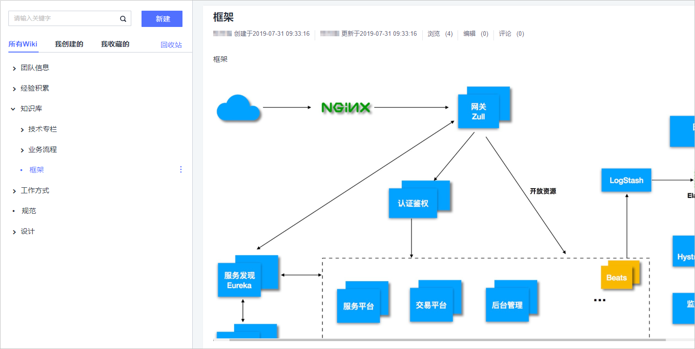

# **项目团队人员变动频繁，如何对新人进行有效培养和管理**

## **背景**

企业随着业务的扩张，需要新员工不断加入，经常会遇到这样的问题，其开发组长要对每一位新人交代相关的知识点、工作方式以及团队信息等，工作量在短期内激增。在一个项目中,随着时间推移、业务的扩张，项目中的核心成员，如项目经理、开发组长等往往都会面临如下几种情况和挑战：

-   新员工加入，需要诸多方面的培养（培训），以便能快速进入工作状态。
-   老员工的离职，导致项目中缺少能了解和掌握关键技术和业务的人员。
-   员工在工作了一段时间后，对自己的规划有了新的想法，从而想要转换工作方向。

那么，项目负责人应该如何应对这些事件呢？

## **问题分析**

一个项目在从小到大的过程中，项目团队也势必扩张，面临新员工的加入。新员工对刚接触的项目不够熟悉，所以针对新员工的培养（培训）是非常有必要投入人员配置的。

项目发展过渡到平稳期的时候，可能会因为公司体质、薪资待遇、员工身心疲惫等原因，出现老员工的离职等情况，如果离职的老员工是核心骨干，就可能导致某些如业务无人知晓、关键技术断层等风险，当然在此期间，也包括老员工随着项目的延续，慢慢产生了对原来工作厌倦，或者因认知的提升以想要寻求一些新的工作内容，进而做了转型的打算。所以上述问题，如果没有得到较好的解决，将会影响到项目的进度和造成不必要的开销，甚至对于团队内部成长、自组织能力的发展建设也是不利的。

所以问题的关键，仍旧是新人的培养。

## **解决措施**

一般来说，在针对新员工加入所带来的内耗、关键核心人员的离职风险、个人发展转型等情况的应对，可以从**团队信息**、**工作方式**以及**知识管理**三方面来通过建立信息管理库进行解决。

DevCloud是集华为研发实践、前沿研发理念、先进研发工具为一体的研发云平台（更多了解请见附件或官网），也是笔者目前在使用的。以DevCloud为例，在DevCloud中提供了Wiki服务。Wiki本身是一种以知识库文档为中心，共同创作为手段，依靠众人不断地更新修改为实现的多人协作的工具。我们可以通过Wiki来管理和搭建项目或团队内的信息管理库，以达到有知识点可留存，有基本信息可查的目的，参考如下：

-   **团队信息**

    用来记录项目团队的职能划分，职责担当等。当新人入职时，可以通过在Wiki中的团队信息，了解团队的组织分工等。这样一方面可以让新员工对团队人员分工有所了解方便日后的交流，另一方面也能让具备较高能力的新员工根据团队组织分工现状提出改善意见等。

    

      

-   **工作方式**

    团队需要制定团队内的工作方式，如对开发流程、代码的管理、需求的变更等，团队统一按照要求进行工作。当有新员工加入，可以通过Wiki中的工作方式，了解相关流程等进而快速开展工作，同时也减轻了老员工在工作方式上对新员工的培训所带来的消耗。

    

      

-   **知识管理**

    知识管理对于项目和团队是最重要的，大部分的产品都需要技术相关的输出整理，无论是基于现有项目进行维护，还是重构，开发新的应用，做知识整理都是不可或缺的。这种必要性在于，当新员工加入后，可以通过知识管理的学习了解项目所用技术框架，进而快速上手工作；当老员工离职，团队因有了Wiki对技术、框架、业务等知识的相关管理，可以较好的应对离职所带来没有backup、没有其他人懂某项技术、没有其他人知道某段业务逻辑等带来的影响；当员工内部转岗或转变业务技术方向时，可以帮助其相关知识，有助于更好的帮助提升跨专业技能。

    

      

更多关于Wiki的相关内容请参见[项目管理用户指南-管理Wiki](https://support.huaweicloud.com/usermanual-projectman/wiki_ug_1001.html)。

  

