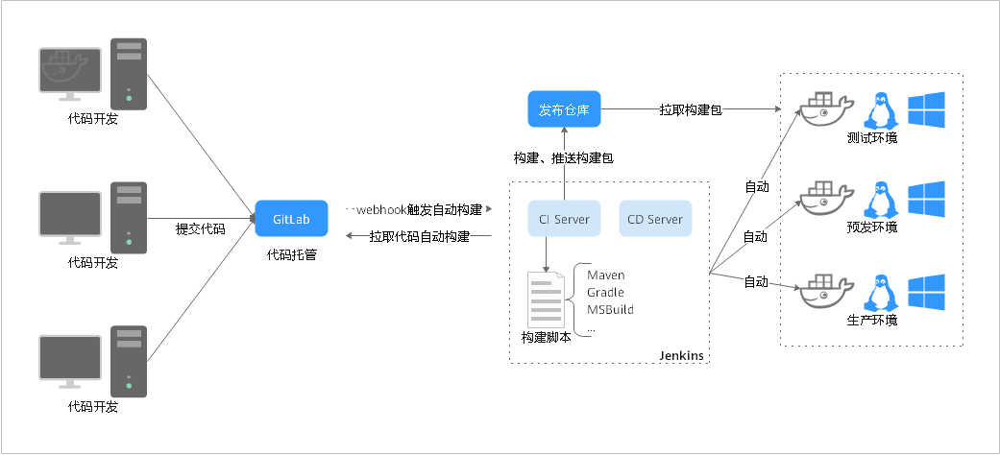

# **Jenkins迁移概览**

本指南主要为用户提供Jenkins迁移到华为云软件开发平台DevCloud（后文统称为DevCloud）的迁移方案建议与操作指导。

Jenkins是一个开源的、基于Java开发的持续集成工具，用于监控持续重复的工作。作为一个可扩展的自动化服务器，Jenkins可以用作简单的CI服务器，或者变成任何项目的持续交付中心。Jenkins使用流程场景如下图所示：

## **迁移场景介绍**

本文根据持续交付的流程特征，着手从以下几个用户常用CI/CD场景进行Jenkins迁移：

-   场景一：GitLab+Maven+Tomcat
-   场景二：SVN+Gradle+Docker
-   场景三：GitLab+MsBuild+IIS

## **迁移前准备**

-   **账号申请**：使用华为云软件开发平台DevCloud前，请确保您已拥有已实名认证的华为云账号；若您还没有华为云账号，请先进行注册，并完成实名认证。
-   **DevCloud项目创建**：在DevCloud中创建项目，操作步骤请参考[新建Scrum项目](https://support.huaweicloud.com/usermanual-projectman/devcloud_hlp_00021sm.html)或[新建看板项目](https://support.huaweicloud.com/usermanual-projectman/devcloud_hlp_00021.html#section4)。
-   **购买弹性云服务器**：DevCloud部署将使用带有公网IP的云服务器，如果有可以不必购买。本文使用的是华为云ECS，购买方式请参考[购买并登录Linux弹性云服务器](https://support.huaweicloud.com/qs-ecs/zh-cn_topic_0132727313.html)。

